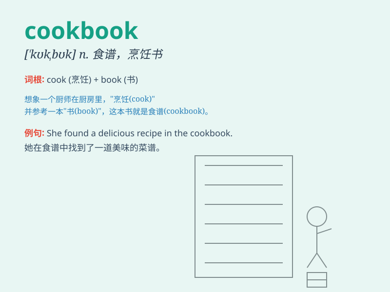

## cookbook

**英音:** _[\'kʊkbʊk]_ **美音:** _[\'kʊkbʊk]_

**译义:** *n.食谱*

### 短语

+ **cookbook collection:** _食谱集_

+ **family cookbook:** _家庭食谱_

+ **professional cookbook:** _专业食谱_

+ **cookbook author:** _食谱作者_

+ **cookbook review:** _食谱评论_

### 例句

#### 例句1

> **I bought a new cookbook to learn some fancy recipes.**

**中文翻译:** 我买了一本新的烹饪书来学习一些新奇的食谱。

**单词释义:** 烹饪书

#### 例句2

> **The cookbook contains detailed instructions and beautiful
pictures.**

**中文翻译:** 这本烹饪书包含了详细的说明和漂亮的图片。

**单词释义:** 烹饪书

#### 例句3

> **She referred to the cookbook when making the cake.**

**中文翻译:** 她在做蛋糕时参考了那本烹饪书。

**单词释义:** 烹饪书

### 背诵小故事

> One day, a little chef was lost in the kitchen. Suddenly, he found a
magical cookbook that guided him to make delicious dishes. With its
help, he became a great cook. The cookbook was his secret weapon!

**有一天，一位小厨师在厨房迷路了。突然，他发现了一本神奇的烹饪书，指引他做出美味的菜肴。在它的帮助下，他成为了一名出色的厨师。这本烹饪书就是他的秘密武器！**

### 图义

