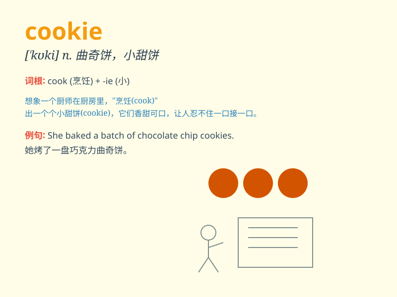

## cookie

**英音:** _[\'kʊkɪ]_ **美音:** _[\'kʊki]_

**译义:**
*n.(苏格兰)甜面包,(美国)小甜饼,一种网络服务器传递给浏览器的信息*

### 短语

+ **chocolate cookie:** _巧克力曲奇_

+ **cookie jar:** _饼干罐_

+ **fortune cookie:** _幸运饼干_

+ **cookie cutter:** _饼干切模；千篇一律的_

+ **oatmeal cookie:** _燕麦饼干_

### 例句

#### 例句1

> **I love eating chocolate chip cookies.**

**中文翻译:** 我喜欢吃巧克力曲奇饼干。

**单词释义:** 曲奇饼干

#### 例句2

> **The website uses cookies to remember your preferences.**

**中文翻译:**
这个网站使用小甜饼（网络饼干，指某些网站为了辨别用户身份而存储在用户本地终端上的数据）来记住您的偏好。

**单词释义:**
网络饼干，指某些网站为了辨别用户身份而存储在用户本地终端上的数据

#### 例句3

> **She baked a batch of cookies for the party.**

**中文翻译:** 她为聚会烤了一批小饼干。

**单词释义:** 小饼干

### 背诵小故事

> A little girl went to a bakery. She saw many cookies on the shelf.
They looked so delicious. She bought one and took a big bite. The sweet
taste made her smile.

**一个小女孩去了一家面包店。她看到架子上有很多曲奇饼。它们看起来太美味了。她买了一块，咬了一大口。甜甜的味道让她笑了起来。**

### 图义

