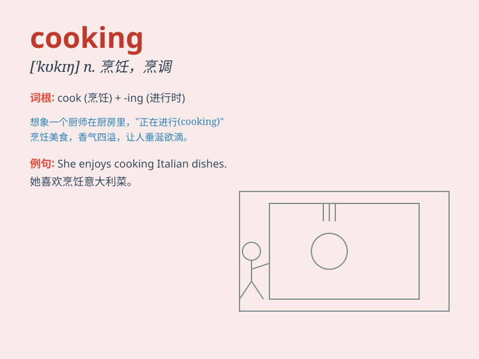

## cooking

**英音:** _[\'kʊkɪŋ]_ **美音:** _[\'kʊkɪŋ]_

**译义:** *n.烹饪*

### 短语

+ **cooking oil:** _食用油_

+ **cooking time:** _烹饪时间_

+ **cooking class:** _烹饪课_

+ **cooking stove:** _炉灶_

+ **cooking pot:** _烹饪锅_

### 例句

#### 例句1

> **I\'m good at cooking Chinese food.**

**中文翻译:** 我擅长做中国菜。

**单词释义:** 烹饪

#### 例句2

> **Cooking is my favorite hobby.**

**中文翻译:** 烹饪是我最喜欢的爱好。

**单词释义:** 烹饪

#### 例句3

> **She spent hours in the kitchen cooking for the party.**

**中文翻译:** 她在厨房里花了几个小时为聚会做饭。

**单词释义:** 做饭

### 背诵小故事

> One day, Tom was very hungry. He decided to learn cooking. He bought
many ingredients and followed the recipe carefully. After some efforts,
he made a delicious meal. Now he loves cooking!

**有一天，汤姆非常饿。他决定学习烹饪。他买了很多食材，认真按照食谱做。经过一番努力，他做出了一顿美味的饭菜。现在他爱上了烹饪！**

### 图义

