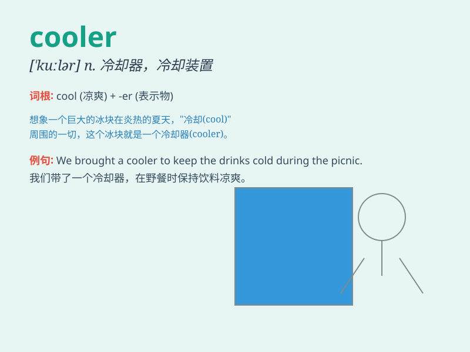

## cooler

**英音:** _[\'kuːlə]_ **美音:** _[\'kulɚ]_

**译义:** *n.冷却器*

### 短语

+ **water cooler:** _饮水机；水冷却器_

+ **oil cooler:** _油冷却器_

+ **wine cooler:** _冰酒器；冷酒器_

+ **air cooler:** _空气冷却器；冷风机_

+ **swamp cooler:** _蒸发式冷气机_

### 例句

#### 例句1

> **The weather is getting cooler and cooler.**

**中文翻译:** 天气变得越来越凉爽。

**单词释义:** 更凉爽的

#### 例句2

> **A cooler is needed to keep the drinks cold.**

**中文翻译:** 需要一个冷却器来保持饮料冰凉。

**单词释义:** 冷却器

#### 例句3

> **This room is much cooler than that one.**

**中文翻译:** 这个房间比那个房间凉快得多。

**单词释义:** 更凉快的

### 背诵小故事

> In a hot summer day, people were sweating. But a smart guy brought a
cooler filled with ice-cold drinks. Everyone felt relieved and thanked
him. The cooler became the hero of the day!

**在一个炎热的夏日，人们都在流汗。但是一个聪明的家伙带来了一个装满冰镇饮料的冷却器。每个人都感到轻松了，并感谢他。这个冷却器成了当天的英雄！**

### 图义

