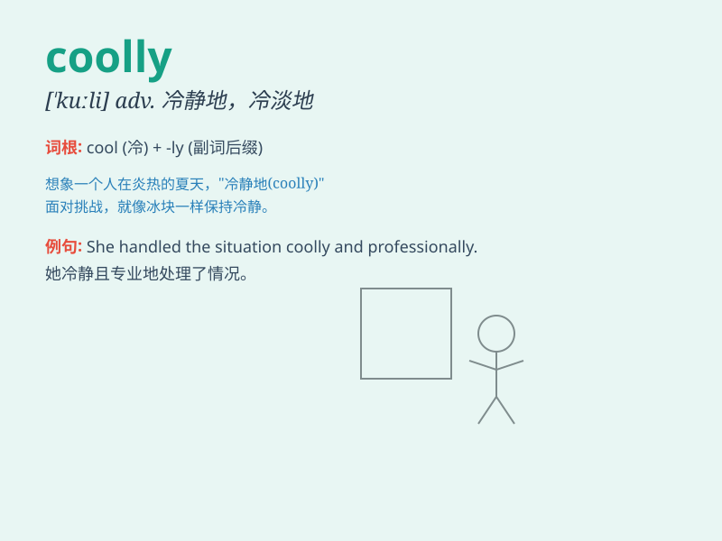

## coolly

**英音:** _[ˈkuːlli]_ **美音:** _[ˈkuːlli]_

**译义:** *adv.沉着,自若*

### 短语

+ **coolly calm:** _冷静沉着_

+ **coolly detached:** _冷淡超脱_

+ **coolly composed:** _沉着镇定_

+ **coolly rational:** _冷静理性_

+ **coolly calculating:** _冷静盘算_

### 例句

#### 例句1

> **He coolly observed the situation before making a decision.**

**中文翻译:** 他冷静地观察了情况后才做出决定。

**单词释义:** 冷静地

#### 例句2

> **She coolly dealt with the difficult customer.**

**中文翻译:** 她沉着地应对了那个难缠的顾客。

**单词释义:** 沉着地

#### 例句3

> **The thief coolly walked away as if nothing had happened.**

**中文翻译:** 那个小偷若无其事地走开了。

**单词释义:** 若无其事地

### 背诵小故事

> One hot summer day, everyone was sweating. But Tom remained calm and
coolly handled all the problems. His coolness made him stand out. He
wasn\'t bothered by the heat and chaos at all.

**在一个炎热的夏日，每个人都汗流浃背。但汤姆保持冷静，沉着地处理所有问题。他的冷静使他脱颖而出。他完全没有被炎热和混乱所困扰。**

### 图义

