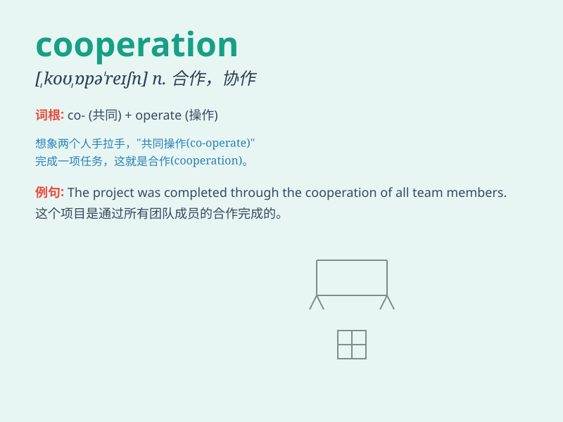

## cooperation

**英音:** _[kəʊ,ɒpə\'reɪʃ(ə)n]_ **美音:**
_[ko,ɑpə\'reʃən]_

**译义:** *n.合作,协作*

### 短语

+ **international cooperation:** _国际合作_

+ **economic cooperation:** _经济合作_

+ **technical cooperation:** _技术合作_

+ **mutual cooperation:** _相互合作_

+ **close cooperation:** _密切合作_

### 例句

#### 例句1

> **The cooperation between the two companies was very
successful.**

**中文翻译:** 这两家公司之间的合作非常成功。

**单词释义:** 合作

#### 例句2

> **We need your cooperation to finish this project on time.**

**中文翻译:** 我们需要你的合作以按时完成这个项目。

**单词释义:** 合作

#### 例句3

> **International cooperation is essential to solve global
problems.**

**中文翻译:** 国际合作对于解决全球问题至关重要。

**单词释义:** 合作

### 背诵小故事

> In a small village, farmers needed to build a new bridge. Everyone
worked together, sharing tools and skills. This successful effort was
all about cooperation. They achieved the goal that no one could do
alone.

**在一个小村庄里，农民们需要建造一座新桥。每个人都一起工作，共享工具和技能。这次成功的努力全靠合作。他们达成了无人能独自完成的目标。**

### 图义

