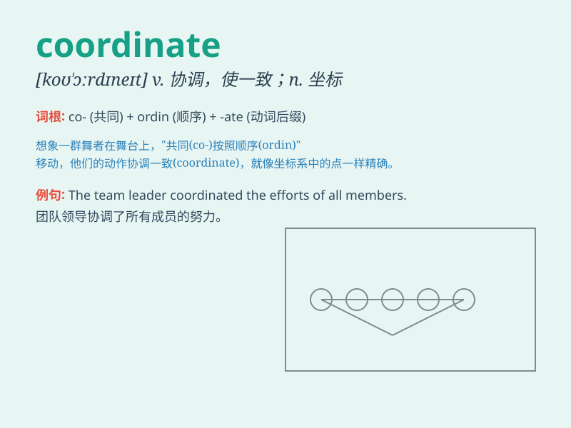

## coordinate

**英音:** _[kəʊ\'ɔ:dɪneɪt]_ **美音:** _[ko\'ɔrdɪnet]_

**译义:**
*n.同等者,同等物,坐标(用复数)adj.同等的,并列的vt.调整,整理*

### 短语

+ **coordinate system:** _坐标系_

+ **coordinate geometry:** _坐标几何_

+ **coordinate with:** _与\...协调；配合_

+ **spatial coordinate:** _空间坐标_

+ **world coordinate:** _世界坐标_

### 例句

#### 例句1

> **The project manager needs to coordinate the efforts of different
teams.**

**中文翻译:** 项目经理需要协调不同团队的努力。

**单词释义:** 协调

#### 例句2

> **The colors of the furniture coordinate well with the
wallpaper.**

**中文翻译:** 家具的颜色与壁纸很协调。

**单词释义:** （使）协调

#### 例句3

> **She wore a blouse and skirt that coordinate perfectly.**

**中文翻译:** 她穿着搭配得完美的衬衫和裙子。

**单词释义:** 搭配

### 背诵小故事

>
想象一下，有一个混乱的地图室，各种线路交织。这时一位聪明的指挥者(coordinator)出现，他协调(coordinate)各方，让地图上的点和线有序排列，最终一切变得清晰明了。

**想象一位指挥者协调混乱的地图室，帮助记忆单词\'coordinate\'，意思是协调、使协调**

### 图义

