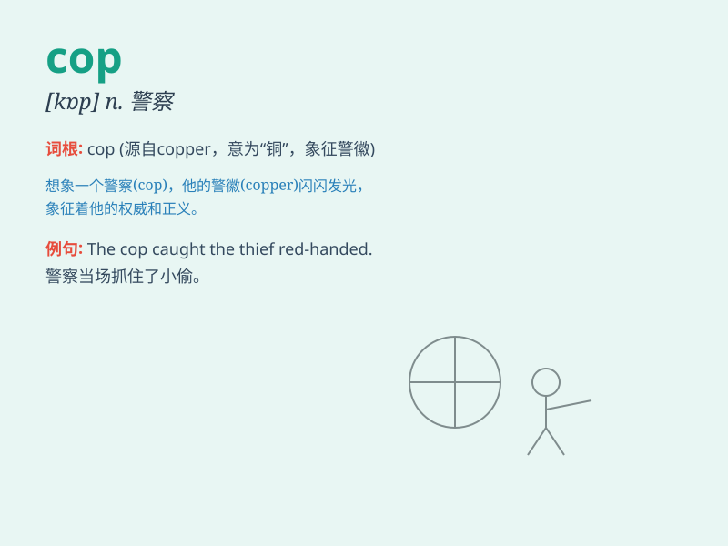

## cop

**英音:** _[kɒp]_ **美音:** _[kɑp]_

**译义:** *n.警官,巡警,[纺]管纱vt.抓住*

### 短语

+ **cop out:** _逃避；回避；退缩_

+ **cop hold of:** _抓住；握住_

+ **beat the cop:** _逃脱警察的追捕_

+ **cop a plea:** _（被告在法庭上）认罪以求轻判_

+ **traffic cop:** _交通警察_

### 例句

#### 例句1

> **The cop stopped the speeding car.**

**中文翻译:** 警察拦下了超速的汽车。

**单词释义:** 警察

#### 例句2

> **He was arrested by the cop for theft.**

**中文翻译:** 他因盗窃被警察逮捕了。

**单词释义:** 警察

#### 例句3

> **The cop is patrolling the neighborhood.**

**中文翻译:** 这位警察正在社区巡逻。

**单词释义:** 警察

### 背诵小故事

> A thief was running away with a bag of money. Suddenly, a brave cop
appeared and chased after him. The cop caught the thief and recovered
the money. Everyone praised the cop for his bravery.

**一个小偷正拿着一袋钱逃跑。突然，一位勇敢的警察出现并追了上去。警察抓住了小偷并追回了钱。大家都称赞这位警察的勇敢。**

### 图义

