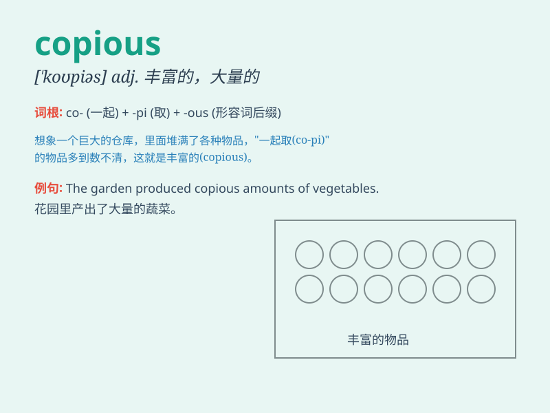

## copious

**英音:** _[\'kəʊpɪəs]_ **美音:** _[\'kopɪəs]_

**译义:** *adj.很多的,广识的,丰富的*

### 短语

+ **copious amounts:** _大量_

+ **copious notes:** _大量的笔记_

+ **copious rainfall:** _充沛的降雨_

+ **copious evidence:** _大量的证据_

+ **copious literature:** _丰富的文献_

### 例句

#### 例句1

> **She wrote copious notes during the lecture.**

**中文翻译:** 她在讲座期间写了大量的笔记。

**单词释义:** 大量的

#### 例句2

> **The book contains copious illustrations.**

**中文翻译:** 这本书包含了大量的插图。

**单词释义:** 大量的

#### 例句3

> **He drank copious amounts of water after the workout.**

**中文翻译:** 锻炼之后，他喝了大量的水。

**单词释义:** 大量的

### 背诵小故事

> A thirsty traveler was lost in the desert. Luckily, he found an oasis
with copious water. He drank and filled his bottles, grateful for the
abundant supply. Remember \'copious\' as the plentiful water that saved
the traveler.

**一位口渴的旅行者在沙漠中迷路了。幸运的是，他发现了一个有大量水的绿洲。他尽情地喝并装满瓶子，对充足的水源心怀感激。记住'copious'就是拯救旅行者的丰富的水。**

### 图义

