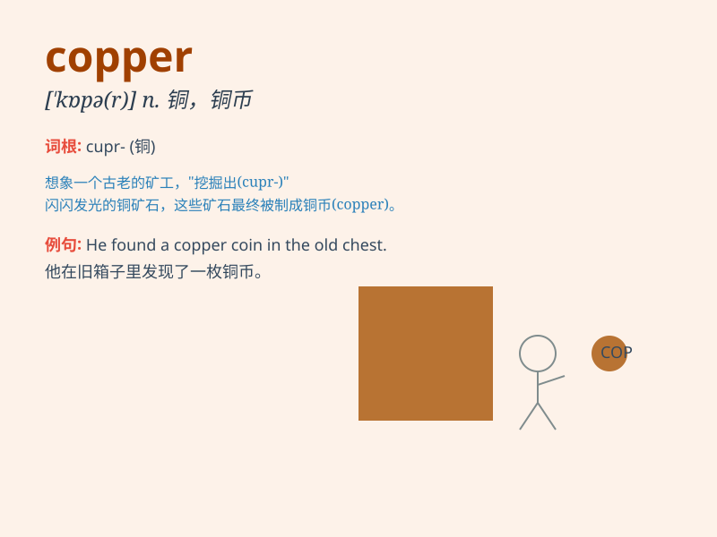

## copper

**英音:** _[\'kɒpə]_ **美音:** _[\'kɑpɚ]_

**译义:** *n.铜,警察*

### 短语

+ **copper wire:** _铜线_

+ **copper mine:** _铜矿_

+ **copper coin:** _铜币_

+ **copper plate:** _铜板_

+ **copper sulfide:** _硫化铜_

### 例句

#### 例句1

> **The statue was made of copper.**

**中文翻译:** 这座雕像由铜制成。

**单词释义:** 铜（一种金属）

#### 例句2

> **The copper wire conducts electricity well.**

**中文翻译:** 铜线导电性能良好。

**单词释义:** 铜（指材料）

#### 例句3

> **He has a copper complexion.**

**中文翻译:** 他有古铜色的肤色。

**单词释义:** 古铜色

### 背诵小故事

> In a small town, there was a brave miner named Tom. One day, he
discovered a rich vein of copper in the mine. The copper was shiny and
valuable, making Tom very happy. From then on, copper became a symbol of
hope and fortune for the town.

**在一个小镇上，有个勇敢的矿工叫汤姆。一天，他在矿井里发现了一条丰富的铜矿脉。铜闪闪发亮且价值不菲，这让汤姆非常高兴。从此，铜成了这个小镇希望和财富的象征。**

### 图义

