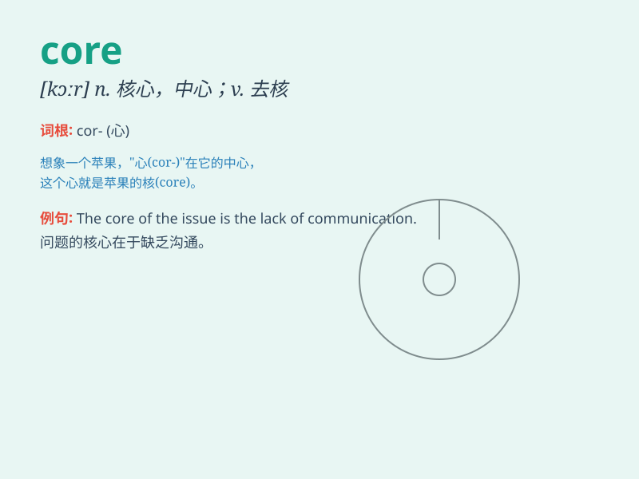

## core

**英音:** _[kɔː]_ **美音:** _[kɔr]_

**译义:** *n.果核,中心,核心*

### 短语

+ **core value:** _核心价值_

+ **core curriculum:** _核心课程_

+ **core business:** _核心业务_

+ **at the core:** _在核心；处于核心地位_

+ **core strength:** _核心力量_

### 例句

#### 例句1

> **The core of the problem lies in poor communication.**

**中文翻译:** 问题的核心在于沟通不畅。

**单词释义:** 核心；中心

#### 例句2

> **She ate the core of the apple.**

**中文翻译:** 她吃了苹果的果核。

**单词释义:** 果核

#### 例句3

> **The company\'s core business is software development.**

**中文翻译:** 这家公司的核心业务是软件开发。

**单词释义:** 核心；主要部分

### 背诵小故事

> In a magical forest, there was a huge tree. The most important part
of the tree was its core. It was like the heart, giving strength and
support. Without the core, the tree would fall. So, \'core\' means the
central and most important part.

**在一个神奇的森林里，有一棵巨大的树。这棵树最重要的部分是它的核心。它就像心脏，给予力量和支撑。没有核心，树就会倒下。所以，'core'意思是中心的、最重要的部分。**

### 图义

