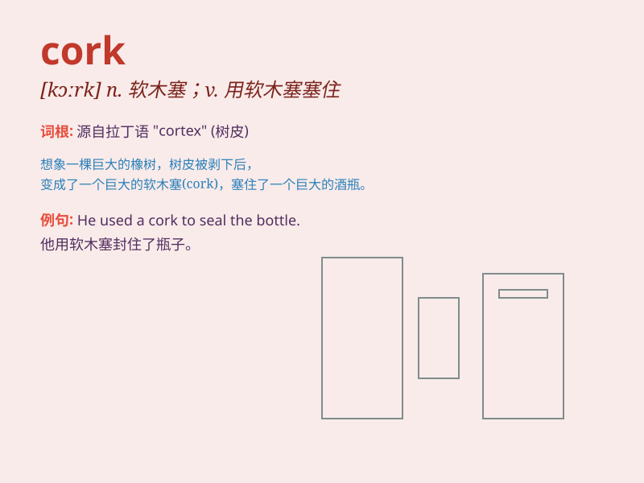

## cork

**英音:** _[kɔːk]_ **美音:** _[kɔrk]_

**译义:** *n.软木塞,软木,(用塞子)塞住*

### 短语

+ **cork oak:** _栓皮栎_

+ **cork stopper:** _软木塞_

+ **cork screw:** _开瓶器；螺旋拔塞器_

+ **cork cambium:** _木栓形成层_

+ **cork flooring:** _软木地板_

### 例句

#### 例句1

> **He pulled the cork out of the bottle.**

**中文翻译:** 他把瓶塞从瓶子里拔了出来。

**单词释义:** 瓶塞

#### 例句2

> **The cork on the surfboard helps it float.**

**中文翻译:** 冲浪板上的软木有助于它漂浮。

**单词释义:** 软木

#### 例句3

> **She used a cork to stopper the test tube.**

**中文翻译:** 她用一个软木塞堵住了试管。

**单词释义:** 软木塞

### 背诵小故事

> A cork was floating on the sea. A little fish thought it was a toy
and swam to it. But when it touched the cork, it bounced back. The fish
was so surprised! Remember, \'cork\' is the thing that can float and
seal bottles.

**一个软木塞漂浮在海面上。一条小鱼以为它是个玩具，游向了它。但当它碰到软木塞时，被弹了回来。小鱼非常惊讶！记住，\'cork\'就是那种能漂浮且能密封瓶子的东西。**

### 图义

