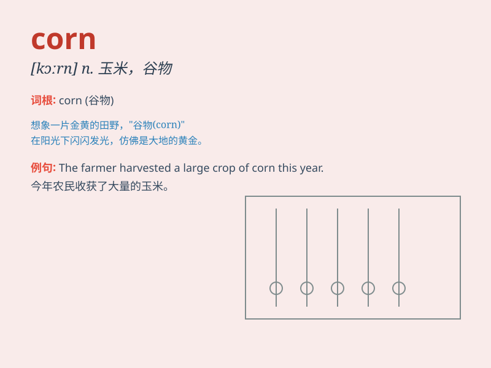

## corn

**英音:** _[kɔːn]_ **美音:** _[kɔrn]_

**译义:** *n.\<美>玉米,\<英>谷物,五谷,[医]鸡眼vt.腌(肉等)*

### 短语

+ **corn field:** _玉米地_

+ **sweet corn:** _甜玉米_

+ **popcorn:** _爆米花_

+ **corn starch:** _玉米淀粉_

+ **corn cob:** _玉米穗轴；玉米棒子_

### 例句

#### 例句1

> **The farmer harvested a lot of corn this year.**

**中文翻译:** 这位农民今年收获了很多玉米。

**单词释义:** 玉米（农作物）

#### 例句2

> **She popped some corn for the movie night.**

**中文翻译:** 她为电影之夜爆了一些爆米花。

**单词释义:** 玉米粒（用于制作爆米花）

#### 例句3

> **The field was filled with rows of tall corn.**

**中文翻译:** 这片田野里满是一排排高高的玉米。

**单词释义:** 玉米（植株）

### 背诵小故事

> One day, a little mouse was very hungry. It found a field full of
corn. The corn was golden and looked so delicious. The mouse happily ate
the corn and felt full.

**有一天，一只小老鼠非常饿。它发现了一块满是玉米的田地。玉米是金黄色的，看起来非常美味。小老鼠开心地吃着玉米，感觉饱饱的。**

### 图义

