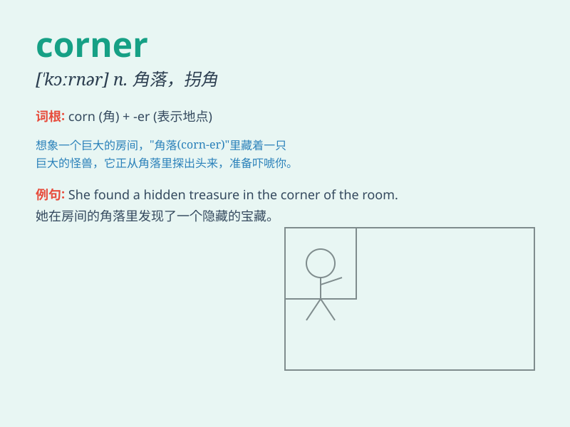

## corner

**英音:** _[\'kɔːnə]_ **美音:** _[ˈkɔrnər]_

**译义:**
*n.角落,(街道)拐角处,(遥远的)地区,偏僻处,困境,绝路vt.迫至一隅,垄断,使陷入绝境,把\...难住vi.相交成角,囤积(in)*

### 短语

+ **around the corner:** _即将来临；在附近_

+ **cut corners:** _偷工减料；走捷径_

+ **in the corner:** _在角落里_

+ **on the corner:** _在拐角处_

+ **corner store:** _街角小店_

### 例句

#### 例句1

> **The cat is sitting in the corner of the room.**

**中文翻译:** 猫坐在房间的角落里。

**单词释义:** 角落；角

#### 例句2

> **She turned the corner and disappeared from sight.**

**中文翻译:** 她转过街角，消失在视线中。

**单词释义:** 街角

#### 例句3

> **The company is trying to corner the market in this new
technology.**

**中文翻译:** 该公司正试图垄断这项新技术的市场。

**单词释义:** 垄断（市场）

### 背诵小故事

> A little mouse was running around in a big room. It felt scared and
wanted to hide. Finally, it found a corner and stayed there quietly. The
corner made it feel safe.

**一只小老鼠在一个大房间里跑来跑去。它感到害怕，想要躲起来。最后，它找到了一个角落，安静地待在那里。这个角落让它感到安全。**

### 图义

