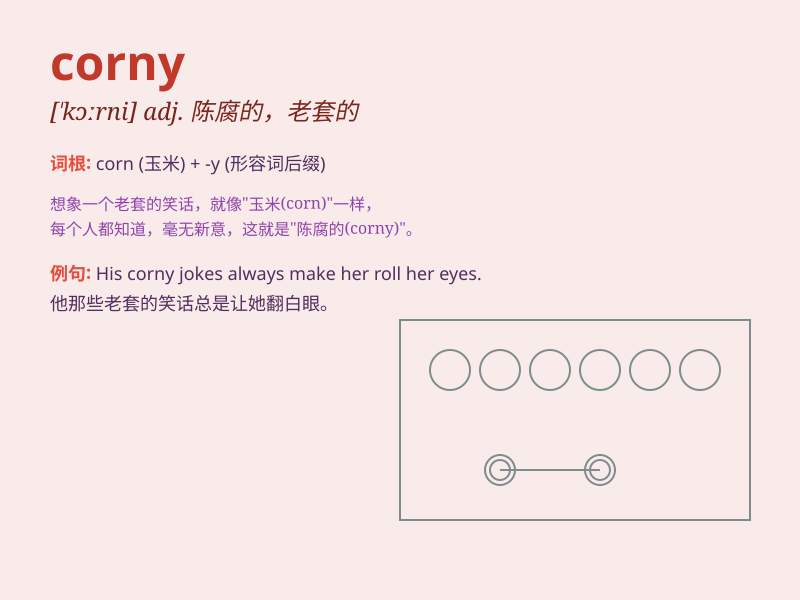

## corny

**英音:** _[\'kɔːnɪ]_ **美音:** _[\'kɔrni]_

**译义:** *adj.谷类的,乡下味的,粗野的,有鸡眼的*

### 短语

+ **corny joke:** _老套的笑话_

+ **corny story:** _陈腐的故事_

+ **corny line:** _俗套的台词_

+ **corny music:** _老土的音乐_

+ **corny film:** _乏味的电影_

+ **corny joke:** _老套的笑话_

+ **corny story:** _陈腐的故事_

+ **corny line:** _俗套的台词_

+ **corny music:** _平庸的音乐_

+ **corny film:** _乏味的电影_

### 例句

#### 例句1

> **The jokes he tells are always so corny.**

**中文翻译:** 他讲的笑话总是那么老土。

**单词释义:** 老套的；陈腐的

#### 例句2

> **That corny love song makes me cringe.**

**中文翻译:** 那首老套的情歌让我感到畏缩。

**单词释义:** 俗气的；平庸的

#### 例句3

> **The movie plot was corny, but still enjoyable.**

**中文翻译:** 电影情节虽然老套，但还是很精彩。

**单词释义:** 陈旧的；乏味的

### 背诵小故事

> A farmer had a field of corn. But the corn was old and not fresh.
People said it was corny. Just like something that is too old-fashioned
or not interesting. So, remember corny means unoriginal or overused.

**一位农民有一片玉米地。但玉米老旧且不新鲜。人们说这很
corny。就像某些过时或无趣的东西。所以，记住 corny
意味着老套或用滥了。**

### 图义

