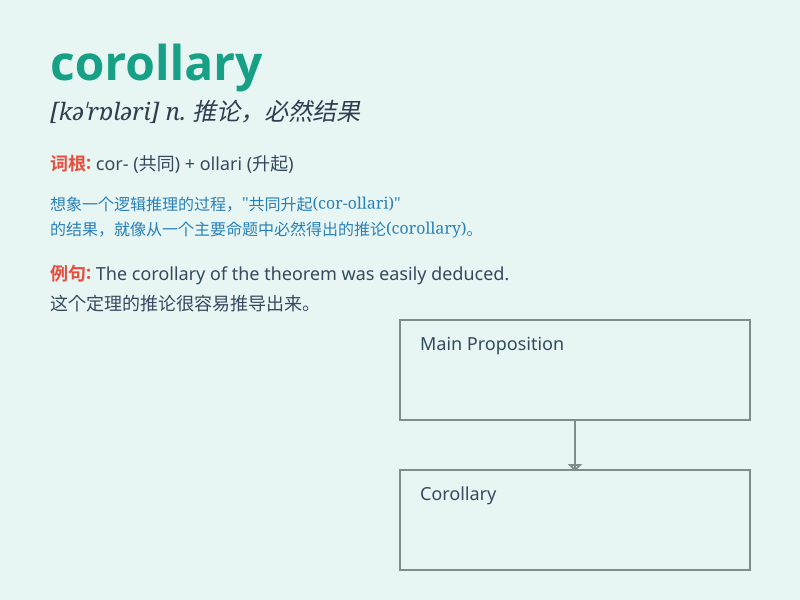

## corollary

**英音:** _[kə\'rɒlərɪ]_ **美音:** _[\'kɔrəlɛri]_

**译义:** *n.必然的结果,系,推论*

### 短语

+ **corollary theorem:** _推论定理_

+ **direct corollary:** _直接推论_

+ **logical corollary:** _逻辑推论_

+ **important corollary:** _重要推论_

+ **obvious corollary:** _明显的推论_

### 例句

#### 例句1

> **The corollary of this theory is that we need to change our
approach.**

**中文翻译:** 这个理论的推论是我们需要改变我们的方法。

**单词释义:** 必然的结果；推论

#### 例句2

> **As a corollary to the above point, we should also consider the
cost.**

**中文翻译:** 作为上述观点的必然结果，我们还应该考虑成本。

**单词释义:** 推论；结果

#### 例句3

> **The corollary of her success is a lot of new opportunities.**

**中文翻译:** 她的成功必然带来很多新的机会。

**单词释义:** 必然结果；随之而来的事物

### 背诵小故事

>
想象一个国王在法庭上裁决案件，他的每一个决定都是一个定理。而那些随之而来、顺理成章的结果，比如对相关人员的处罚或奖赏，就是\'corollary\'，也就是推论、必然的结果。

**想象国王裁决案件，其决定是定理，随之而来的结果如奖惩就是\'推论、必然的结果\'。**

### 图义

