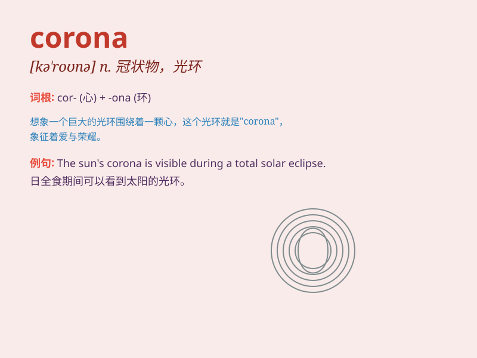

## corona

**英音:** _[kə\'rəʊnə]_ **美音:** _[kə\'ronə]_

**译义:** *n.冠壮物,王冠,光环*

### 短语

+ **corona discharge:** _电晕放电_

+ **corona virus:** _冠状病毒_

+ **solar corona:** _日冕_

+ **corona effect:** _电晕效应_

+ **corona treatment:** _电晕处理_

### 例句

#### 例句1

> **The corona of the sun is visible during a total solar
eclipse.**

**中文翻译:** 日全食期间可以看到太阳的日冕。

**单词释义:** 日冕

#### 例句2

> **The virus has caused a global pandemic known as COVID-19, which
is caused by the SARS-CoV-2 virus that has a distinctive corona
shape.**

**中文翻译:** 该病毒引起了名为 COVID-19
的全球大流行，该病毒是由具有独特冠状形状的 SARS-CoV-2 病毒引起的。

**单词释义:** 冠状物

#### 例句3

> **The corona discharge can be dangerous in certain industrial
settings.**

**中文翻译:** 在某些工业环境中，电晕放电可能很危险。

**单词释义:** 电晕放电

### 背诵小故事

>
想象一个国王戴着金光闪闪的皇冠（corona），皇冠上的宝石闪耀着神秘的光芒。突然，光芒化作病毒，这就是冠状的病毒（corona）。

**想象国王戴的皇冠化作病毒，来辅助记忆corona（冠状、日冕）这个单词**

### 图义

