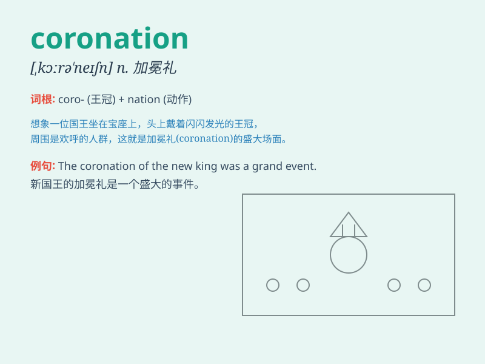

## coronation

**英音:** _[kɒrə\'neɪʃ(ə)n]_ **美音:** _[\'kɔrə\'neʃən]_

**译义:** *n.加冕礼*

### 短语

+ **coronation ceremony:** _加冕典礼_

+ **coronation day:** _加冕日_

+ **coronation robe:** _加冕礼袍_

+ **coronation procession:** _加冕游行_

+ **coronation throne:** _加冕王座_

### 例句

#### 例句1

> **The coronation of the new king was a grand ceremony.**

**中文翻译:** 新国王的加冕典礼是一场盛大的仪式。

**单词释义:** 加冕

#### 例句2

> **She was invited to the coronation of the queen.**

**中文翻译:** 她被邀请参加女王的加冕典礼。

**单词释义:** 加冕

#### 例句3

> **The coronation of Charles III attracted worldwide attention.**

**中文翻译:** 查理三世的加冕典礼引起了全世界的关注。

**单词释义:** 加冕

### 背诵小故事

> The king was very nervous before the coronation. He worried about
making mistakes during the grand ceremony. But in the end, everything
went smoothly and he became the ruler with the crowning glory.

**国王在加冕典礼前非常紧张。他担心在盛大的仪式上出错。但最终，一切顺利，他带着无上的荣耀加冕成为了统治者。**

### 图义

