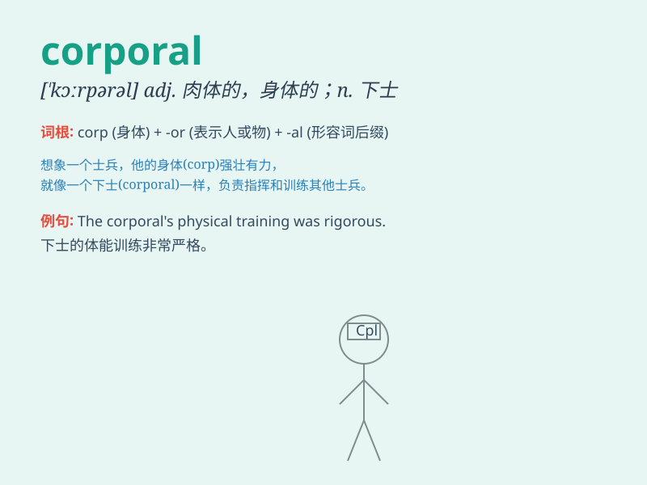

## corporal

**英音:** _[\'kɔːp(ə)r(ə)l]_ **美音:** _[\'kɔrpərəl]_

**译义:** *n.\<美>下士adj.肉体的,身体的*

### 短语

+ **corporal punishment:** _体罚_

+ **corporal works of mercy:** _肉体上的慈悲善举_

+ **corporal oath:** _以身体起誓_

+ **corporal property:** _有形财产_

+ **corporal defect:** _身体缺陷_

### 例句

#### 例句1

> **The corporal led his troops into battle.**

**中文翻译:** 下士率领他的部队投入战斗。

**单词释义:** 下士

#### 例句2

> **He received a corporal punishment for his misbehavior.**

**中文翻译:** 他因行为不端而受到体罚。

**单词释义:** 肉体的

#### 例句3

> **The corporal inspected the soldiers\' uniforms.**

**中文翻译:** 下士检查了士兵们的制服。

**单词释义:** 下士

### 背诵小故事

> A corporal in the army was known for his strong leadership. One day,
during a difficult mission, he showed great courage and led his team to
victory. His corporal rank was a symbol of his responsibility and
bravery.

**军队里的一名下士以其强大的领导力而闻名。有一天，在一次艰难的任务中，他展现出巨大的勇气，带领他的团队取得了胜利。他的下士军衔是他责任和勇敢的象征。**

### 图义

