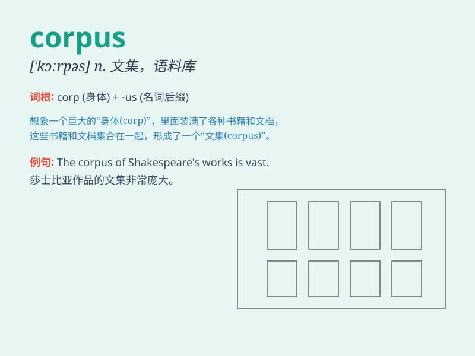

## corpus

**英音:** _[\'kɔːpəs]_ **美音:** _[\'kɔrpəs]_

**译义:** *n.尸体,文集,(某项基金的)本金*

### 短语

+ **corpus callosum:** _胼胝体_

+ **corpus luteum:** _黄体_

+ **corpus juris:** _法典_

+ **corpus delicti:** _犯罪事实_

+ **corpus linguistics:** _语料库语言学_

### 例句

#### 例句1

> **The corpus of her work shows a remarkable evolution in style.**

**中文翻译:** 她的作品集显示了风格上的显着演变。

**单词释义:** 全集；全部作品

#### 例句2

> **A large corpus of data was collected for the research
project.**

**中文翻译:** 该研究项目收集了大量数据。

**单词释义:** 语料库；资料集

#### 例句3

> **The corpus of evidence against him was overwhelming.**

**中文翻译:** 对他不利的证据是压倒性的。

**单词释义:** 主体；（事物的）主要部分

### 背诵小故事

>
想象一下，在一个神秘的图书馆里，存放着大量珍贵的书籍和文献，这些集合起来就构成了一个\'corpus\'。它就像一个知识的宝库，里面充满了无尽的智慧和信息。

**想象在图书馆中，大量书籍文献的集合构成'语料库；文集；本金'**

### 图义

