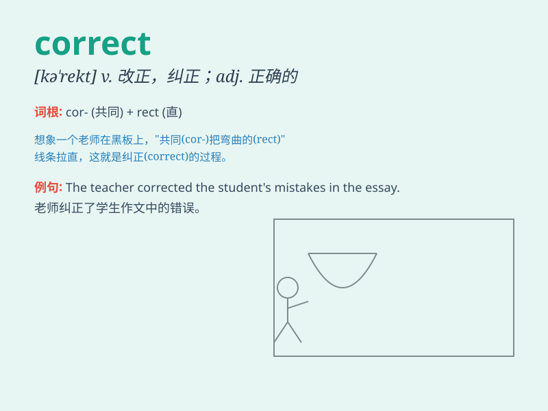

## correct

**英音:** _[kə\'rekt]_ **美音:** _[kə\'rɛkt]_

**译义:** *adj.正确的,恰当的,端正的vt.改正,纠正,告诫,惩戒*

### 短语

+ **correct answer:** _正确答案_

+ **correct mistake:** _改正错误_

+ **correct pronunciation:** _正确的发音_

+ **correct behavior:** _正确的行为_

+ **correct time:** _准确的时间_

### 例句

#### 例句1

> **You should correct your mistakes.**

**中文翻译:** 你应该改正你的错误。

**单词释义:** 改正

#### 例句2

> **The correct answer is option B.**

**中文翻译:** 正确答案是选项B。

**单词释义:** 正确的

#### 例句3

> **Please correct the spelling of this word.**

**中文翻译:** 请纠正这个词的拼写。

**单词释义:** 改正

### 背诵小故事

> One day, Tom wrote an answer in the exam. The teacher checked and
found it was wrong. So Tom corrected it carefully and finally got a high
score. It shows that to be correct is very important.

**一天，汤姆在考试中写了一个答案。老师检查后发现是错的。于是汤姆认真地改正了它，最终取得了高分。这表明正确是非常重要的。**

### 图义

