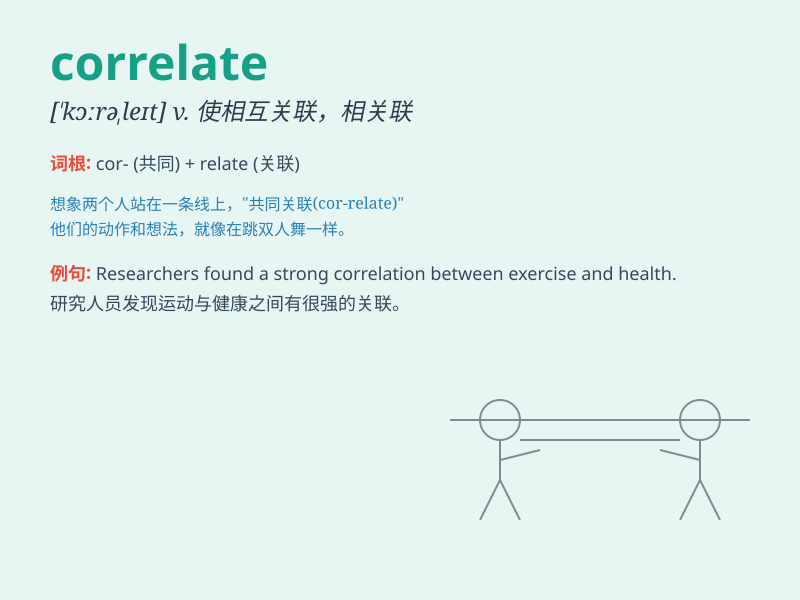

## correlate

**英音:** _[\'kɒrəleɪt; -rɪ-]_ **美音:** _[\'kɔrəlet]_

**译义:** *vt.使相互关联vi.和\...相关*

### 短语

+ **correlate with:** _与\...\...相关；与\...\...相符_

+ **correlate to:** _把\...\...与\...\...联系起来_

+ **positively correlate:** _正相关_

+ **negatively correlate:** _负相关_

+ **highly correlate:** _高度相关_

### 例句

#### 例句1

> **The study found that stress correlates strongly with poor
health.**

**中文翻译:** 研究发现，压力与健康状况不佳密切相关。

**单词释义:** 相关；关联

#### 例句2

> **The increase in crime correlates with the rise in
unemployment.**

**中文翻译:** 犯罪率的上升与失业率的上升相关。

**单词释义:** 相互关联；相互联系

#### 例句3

> **Researchers are trying to correlate the two sets of data.**

**中文翻译:** 研究人员正在尝试将这两组数据关联起来。

**单词释义:** 使相互关联；使建立联系

### 背诵小故事

> A scientist was studying two sets of data. One was about temperature
changes and the other was about ice melting. He found that as the
temperature rose, more ice melted. This showed that the two things
correlate - they are related and change together.

**一位科学家正在研究两组数据。一组是关于温度变化的，另一组是关于冰融化的。他发现随着温度升高，更多的冰融化了。这表明这两件事相互关联------它们是相关的并且一起变化。**

### 图义

