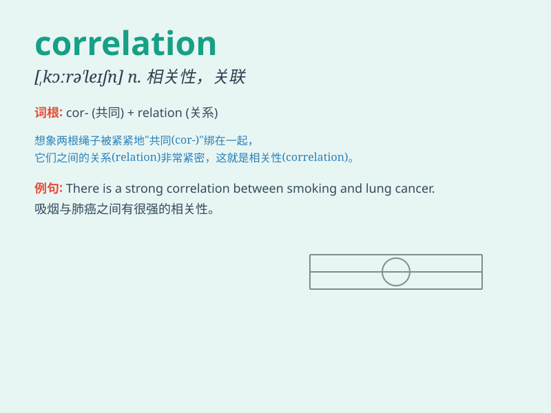

## correlation

**英音:** _[,kɒrə\'leɪʃ(ə)n; -rɪ-]_ **美音:**
_[,kɔrə\'leʃən]_

**译义:** *n.相互关系,相关(性)*

### 短语

+ **positive correlation:** _正相关_

+ **negative correlation:** _负相关_

+ **linear correlation:** _线性相关_

+ **correlation coefficient:** _相关系数_

+ **high correlation:** _高度相关_

### 例句

#### 例句1

> **There is a strong correlation between smoking and lung
cancer.**

**中文翻译:** 吸烟与肺癌之间有很强的相关性。

**单词释义:** 相关性

#### 例句2

> **The correlation of these two factors is not yet clear.**

**中文翻译:** 这两个因素的相关性尚不清楚。

**单词释义:** 相关性

#### 例句3

> **We found a positive correlation between exercise and mental
health.**

**中文翻译:** 我们发现运动和心理健康之间存在正相关关系。

**单词释义:** 相关性

### 背诵小故事

> A scientist was studying the correlation between sleep and
performance. He found that people who got enough sleep had better
performance at work. The connection between these two factors was the
\'correlation\' he was seeking.

**一位科学家正在研究睡眠和表现之间的相关性。他发现睡眠充足的人在工作中表现更好。这两个因素之间的联系就是他所寻求的'相关性'。**

### 图义

