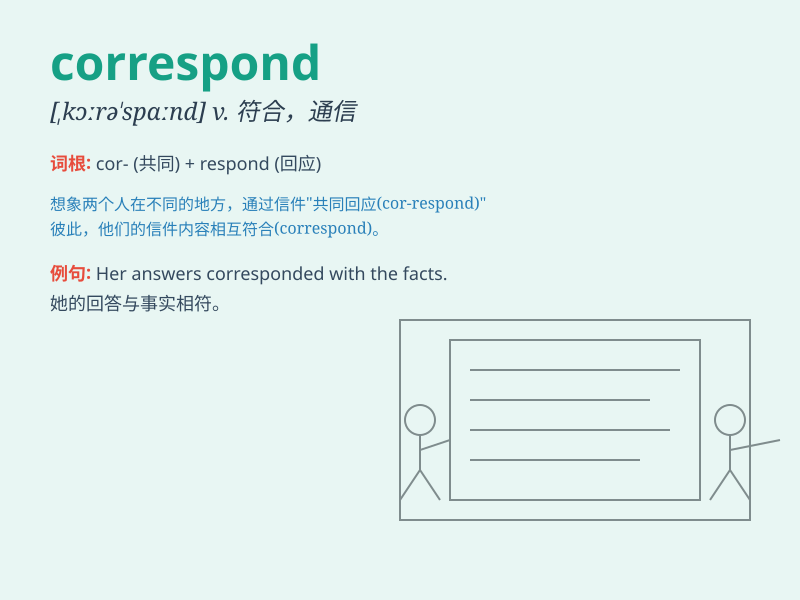

## correspond

**英音:** _[kɒrɪ\'spɒnd]_ **美音:** _[,kɔrə\'spɑnd]_

**译义:** *vi.符合,协调,通信,相当,相应*

### 短语

+ **correspond with:** _与\...\...相符合；与\...\...通信_

+ **correspond to:** _相当于；与\...\...相符_

+ **correspond closely:** _紧密对应_

+ **correspond approximately:** _大致相符_

+ **correspond irregularly:** _无规律地相符_

### 例句

#### 例句1

> **Your account of events does not correspond with hers.**

**中文翻译:** 你对事件的描述与她的不符。

**单词释义:** 与\...\...相符

#### 例句2

> **The two sisters correspond every week.**

**中文翻译:** 两姐妹每周都会通信。

**单词释义:** 通信

#### 例句3

> **The British job of Lecturer corresponds roughly to the US
Associate Professor.**

**中文翻译:** 英国的讲师职位大致相当于美国的副教授。

**单词释义:** 相当于

### 背诵小故事

> A young writer corresponds with a famous author. They exchange
letters, sharing thoughts and ideas. Through this correspondence, the
young writer grows and learns. It shows how corresponding can lead to
growth and connection.

**一位年轻的作家与一位著名的作家通信。他们交换信件，分享想法和观点。通过这种通信，年轻的作家成长和学习。这展示了通信如何能带来成长和联系。**

### 图义

