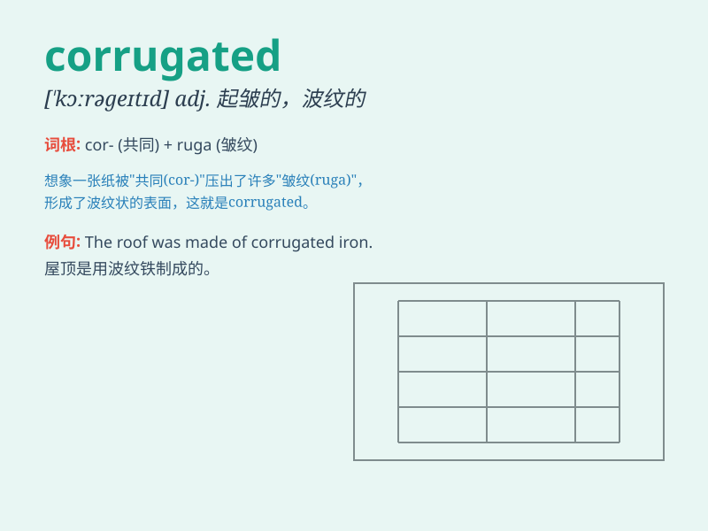

## corrugated

**英音:** _[\'kɒrəɡeɪtɪd]_ **美音:** _[\'kɔrə\'getɪd]_

**译义:** *adj.缩成皱纹的,使起波状的*

### 短语

+ **corrugated iron:** _波纹铁皮_

+ **corrugated cardboard:** _瓦楞纸板_

+ **corrugated sheet:** _波纹板_

+ **corrugated pipe:** _波纹管_

+ **corrugated container:** _波纹集装箱_

### 例句

#### 例句1

> **The corrugated iron roof was rusty and in need of repair.**

**中文翻译:** 波纹铁皮屋顶生锈了，需要修理。

**单词释义:** 波纹状的

#### 例句2

> **The corrugated cardboard box was strong enough to hold the heavy
items.**

**中文翻译:** 瓦楞纸板箱足够坚固，可以容纳重物。

**单词释义:** 波纹状的

#### 例句3

> **She walked on the corrugated path with caution.**

**中文翻译:** 她小心翼翼地走在波纹小路上。

**单词释义:** 波纹状的

### 背诵小故事

> A little mouse was running in a corrugated pipe. It was very dark
inside, but the corrugated surface helped it not slip. \'Corrugated\'
means having a series of folds or grooves.

**一只小老鼠在一根波纹状的管子里跑。里面很暗，但波纹状的表面帮助它不滑倒。\'corrugated\'意思是有一系列褶皱或沟槽的。**

### 图义

