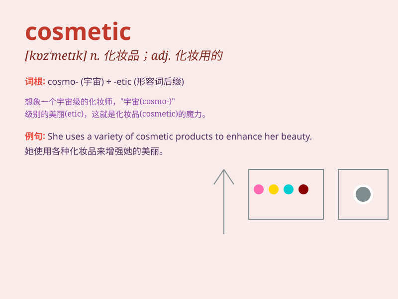

## cosmetic

**英音:** _[kɒz\'metɪk]_ **美音:** _[kɑz\'mɛtɪk]_

**译义:** *n.化妆品adj.化妆用的*

### 短语

+ **cosmetic surgery:** _整容手术_

+ **cosmetic product:** _化妆品_

+ **cosmetic brand:** _化妆品品牌_

+ **cosmetic effect:** _美容效果_

+ **cosmetic bag:** _化妆包_

### 例句

#### 例句1

> **She spent a lot of money on cosmetic products to enhance her
appearance.**

**中文翻译:** 她花了很多钱在化妆品上以提升她的外表。

**单词释义:** 化妆品

#### 例句2

> **The new law is just a cosmetic change; it doesn\'t solve the real
problem.**

**中文翻译:** 新法律只是表面上的改变；它没有解决真正的问题。

**单词释义:** 表面的；装饰性的

#### 例句3

> **The cosmetic surgery made her look much younger.**

**中文翻译:** 整容手术让她看起来年轻多了。

**单词释义:** 整容的；美容的

### 背诵小故事

> A princess was worried about her looks. So, a kind witch gave her a
special cosmetic. With it, the princess became more beautiful and
confident. Cosmetic means something used to make one look better.

**一位公主为自己的容貌担忧。于是，一位善良的女巫给了她一种特殊的化妆品。用了它，公主变得更美丽和自信。Cosmetic
意思是用于让人看起来更好的东西。**

### 图义

