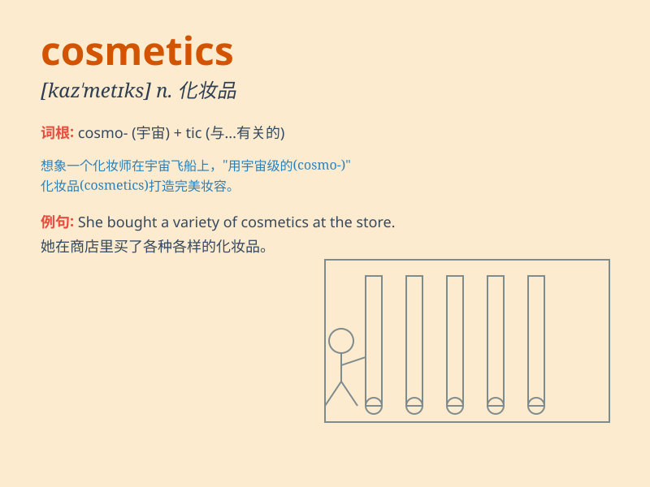

## cosmetics

**英音:** _[kɒz\'mɛtɪks]_ **美音:** _[kɑːzˈmɛtɪks]_

**译义:** *n.化妆品；美容品；装饰品*

### 短语

+ **cosmetics industry:** _化妆品行业_

+ **cosmetics counter:** _化妆品柜台_

+ **cosmetics brand:** _化妆品品牌_

+ **natural cosmetics:** _天然化妆品_

+ **organic cosmetics:** _有机化妆品_

### 例句

#### 例句1

> **She spent a lot of money on cosmetics every month.**

**中文翻译:** 她每个月在化妆品上花很多钱。

**单词释义:** 化妆品

#### 例句2

> **The store sells a wide range of cosmetics.**

**中文翻译:** 这家商店出售各种各样的化妆品。

**单词释义:** 化妆品

#### 例句3

> **Cosmetics can enhance one\'s appearance, but inner beauty is more
important.**

**中文翻译:** 化妆品可以提升一个人的外表，但内在美更重要。

**单词释义:** 化妆品

### 背诵小故事

> A fairy was known for her amazing cosmetics. She used them to make
everyone look beautiful. One day, a girl lost her confidence. The fairy
gave her some cosmetics and transformed her. From then on, the girl
understood the magic of cosmetics.

**一位仙女以她神奇的化妆品而闻名。她用它们让每个人都看起来很漂亮。有一天，一个女孩失去了信心。仙女给了她一些化妆品并改变了她。从那时起，这个女孩明白了化妆品的魔力。**

### 图义

