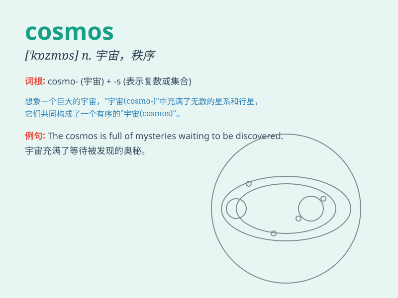

## cosmos

**英音:** _[\'kɒzmɒs]_ **美音:** _[\'kɑzmos]_

**译义:** * 宇宙*

### 短语

+ **cosmos flower:** _大波斯菊_

+ **cosmos theory:** _宇宙论_

+ **cosmos exploration:** _宇宙探索_

+ **cosmos mystery:** _宇宙之谜_

+ **cosmos voyage:** _宇宙航行_

### 例句

#### 例句1

> **The study of the cosmos helps us understand the mysteries of the
universe.**

**中文翻译:** 对宇宙的研究帮助我们理解宇宙的奥秘。

**单词释义:** 宇宙

#### 例句2

> **She has always been fascinated by the beauty and complexity of
the cosmos.**

**中文翻译:** 她一直被宇宙的美丽和复杂性所吸引。

**单词释义:** 宇宙

#### 例句3

> **The cosmos is full of unknown wonders waiting to be
discovered.**

**中文翻译:** 宇宙充满了未知的奇迹等待被发现。

**单词释义:** 宇宙

### 背诵小故事

>
想象一下，你是一位勇敢的宇航员，在太空中遨游。你看到无数的星星、行星和星系，这浩瀚而美丽的一切就是\'cosmos\'，宇宙。你被这神奇的景象深深吸引，永远记住了\'cosmos\'代表的宇宙。

**想象宇航员在太空看到的景象来记住\'cosmos\'表示宇宙**

### 图义

