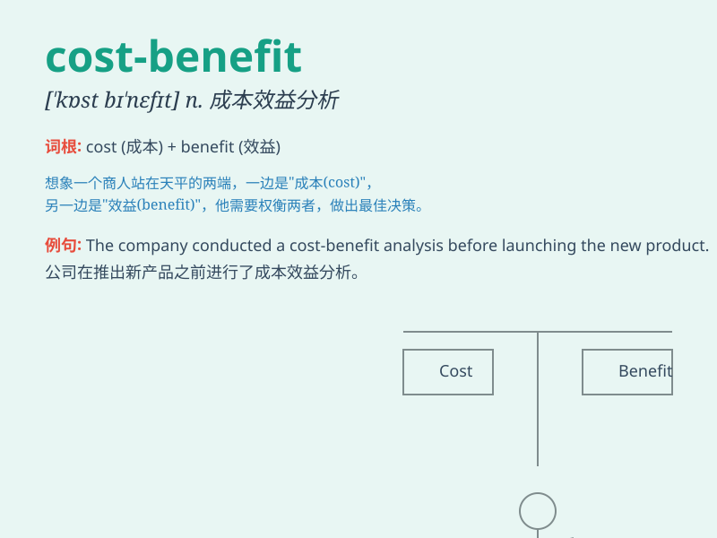

## cost-benefit

**英音:** _[kɒst \'bɛnɪfɪt]_ **美音:** _[kɔst
\'bɛnɪfɪt]_

**译义:** *n. 成本效益分析；成本与效益的比较*

### 短语

+ **cost-benefit analysis:** _成本效益分析_

+ **cost-benefit ratio:** _成本效益比_

+ **cost-benefit study:** _成本效益研究_

+ **cost-benefit approach:** _成本效益方法_

+ **cost-benefit assessment:** _成本效益评估_

### 例句

#### 例句1

> **The cost-benefit analysis showed that the project was not
feasible.**

**中文翻译:** 成本效益分析表明这个项目不可行。

**单词释义:** 成本效益

#### 例句2

> **We need to conduct a detailed cost-benefit study before making a
decision.**

**中文翻译:** 在做决定之前，我们需要进行详细的成本效益研究。

**单词释义:** 成本效益

#### 例句3

> **The new policy was evaluated based on cost-benefit
considerations.**

**中文翻译:** 新政策是基于成本效益的考虑进行评估的。

**单词释义:** 成本效益

### 背诵小故事

> Imagine a company considering a new project. They calculate the costs
like materials and labor and the benefits like increased sales. This
process of weighing the costs against the benefits is called
\'cost-benefit\'.

**想象一家公司在考虑一个新项目。他们计算像材料和劳动力这样的成本，以及像增加的销售额这样的收益。这种权衡成本和收益的过程就被称为'成本效益'。**

### 图义

