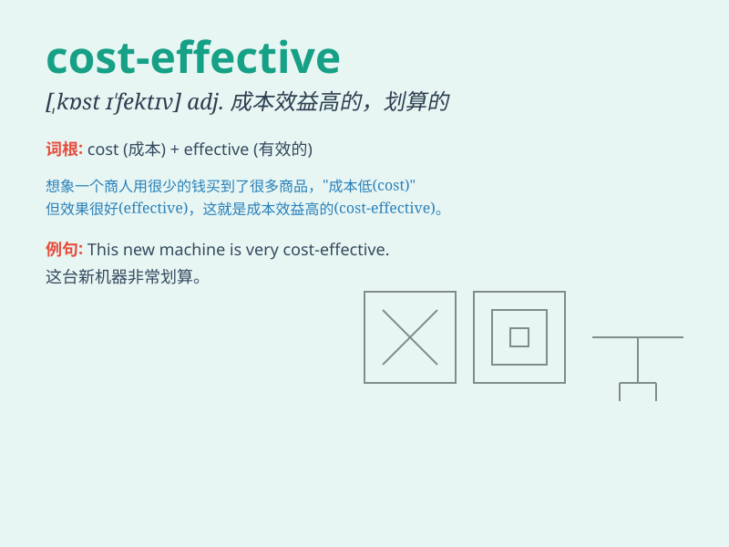

## cost-effective

**英音:** _[ˌkɒst ɪˈfɛktɪv]_ **美音:** _[ˌkɔːst
ɪˈfɛktɪv]_

**译义:** *adj. 成本效益好的；划算的；有成本效益的*

### 短语

+ **cost-effective measure:** _具有成本效益的措施_

+ **cost-effective solution:** _成本效益高的解决方案_

+ **cost-effective approach:** _经济有效的方法_

+ **cost-effective product:** _性价比高的产品_

+ **cost-effective strategy:** _成本效益策略_

### 例句

#### 例句1

> **This new energy-saving device is highly cost-effective.**

**中文翻译:** 这种新的节能设备性价比非常高。

**单词释义:** 划算的，成本效益好的

#### 例句2

> **The company is always looking for cost-effective solutions to
improve productivity.**

**中文翻译:** 公司一直在寻找具有成本效益的解决方案以提高生产力。

**单词释义:** 具有成本效益的

#### 例句3

> **Public transportation is a cost-effective way to travel in the
city.**

**中文翻译:** 在城市里，公共交通是一种经济实惠的出行方式。

**单词释义:** 经济实惠的

### 背诵小故事

> A small company was struggling to make profits. Then they found a new
supplier whose products were cost-effective. With lower costs but good
quality, the company thrived. It shows that being cost-effective means
good value for money.

**一家小公司一直在努力盈利。然后他们找到了一个新的供应商，其产品具有成本效益。成本低但质量好，公司蓬勃发展。这表明具有成本效益意味着物有所值。**

### 图义

