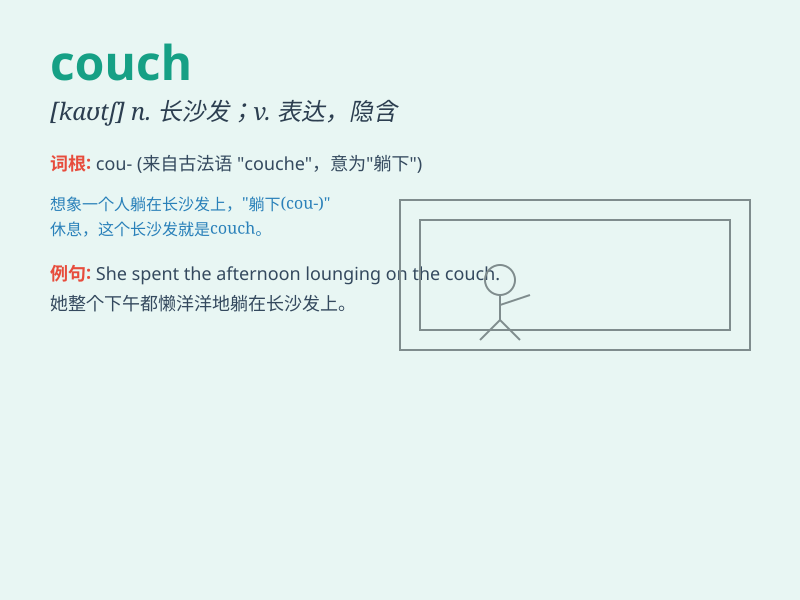

## couch

**英音:** _[kaʊtʃ]_ **美音:** _[kaʊtʃ]_

**译义:** *n.(文学)床,睡椅 v.(用语言)表达*

### 短语

+ **couch potato:**
_成天躺著或坐在沙发上看电视的人；极为懒惰的人_

+ **psychoanalytic couch:** _精神分析躺椅_

+ **couch grass:** _茅草_

+ **on the couch:** _接受心理分析；在接受治疗_

+ **couch surfing:** _借宿；沙发旅行（在别人家的沙发借宿）_

### 例句

#### 例句1

> **She lay down on the couch and closed her eyes.**

**中文翻译:** 她躺在沙发上，闭上了眼睛。

**单词释义:** 沙发

#### 例句2

> **The psychologist asked the patient to describe his feelings while
sitting on the couch.**

**中文翻译:** 心理学家要求病人描述他坐在沙发上的感受。

**单词释义:** 沙发

#### 例句3

> **The cat was curled up asleep on the couch.**

**中文翻译:** 猫蜷缩在沙发上睡着了。

**单词释义:** 沙发

### 背诵小故事

> One day, I was so tired that I threw myself onto the couch. It was
soft and comfortable, like a big hug. I lay there, feeling relaxed and
forgetting all my troubles. The couch became my best friend at that
moment.

**有一天，我非常累，一下子扑到了沙发上。它又软又舒服，就像一个大大的拥抱。我躺在那里，感到很放松，忘记了所有的烦恼。在那一刻，沙发成了我最好的朋友。**

### 图义

