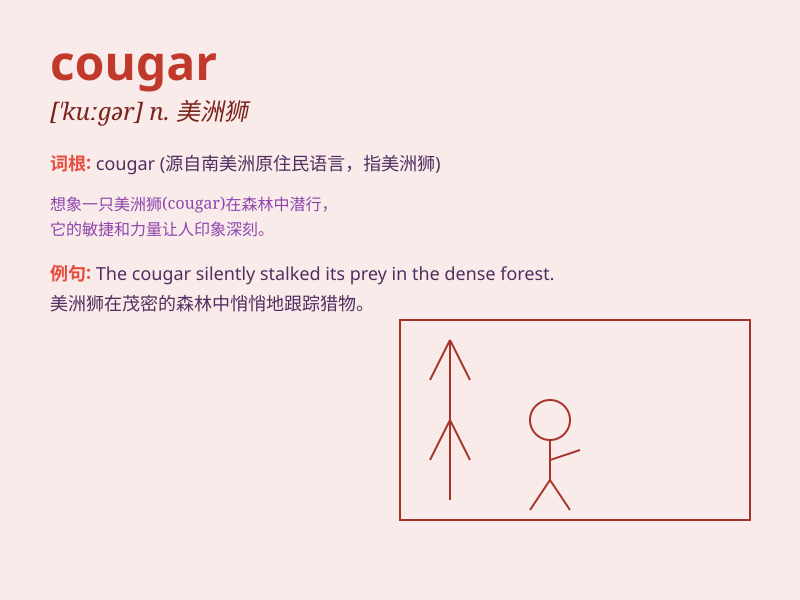

## cougar

**英音:** _[\'kuːgə]_ **美音:** _[\'kuɡɚ]_

**译义:** *n.[动]美洲狮(尤指Felis concolor)*

### 短语

+ **mountain cougar:** _山狮_

+ **cougar attack:** _美洲狮袭击_

+ **cougar sighting:** _看到美洲狮_

+ **cougar habitat:** _美洲狮栖息地_

+ **young cougar:** _年轻的美洲狮_

### 例句

#### 例句1

> **I saw a cougar in the mountains during my hiking trip.**

**中文翻译:** 我在徒步旅行时在山上看到一只美洲狮。

**单词释义:** 美洲狮

#### 例句2

> **The cougar is a powerful and stealthy predator.**

**中文翻译:** 美洲狮是一种强大而隐秘的掠食者。

**单词释义:** 美洲狮

#### 例句3

> **She was frightened when she heard the roar of a cougar
nearby.**

**中文翻译:** 当她听到附近美洲狮的吼叫声时，她感到害怕。

**单词释义:** 美洲狮

### 背诵小故事

> In the deep forest, a brave adventurer was walking. Suddenly, a
cougar appeared. Its sharp eyes and strong body made the adventurer hold
his breath. The cougar moved gracefully but with a hint of danger.

**在幽深的森林里，一位勇敢的冒险家正在行走。突然，一只美洲狮出现了。它锐利的眼睛和强壮的身躯让冒险家屏住了呼吸。这只美洲狮动作优雅但带着一丝危险。**

### 图义

