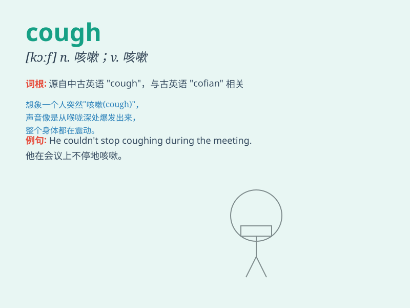

## cough

**英音:** _[kɒf]_ **美音:** _[kɔf]_

**译义:** *n.咳嗽v.咳嗽*

### 短语

+ **cough up:** _勉强交出；被迫付出_

+ **cough syrup:** _止咳糖浆_

+ **chronic cough:** _慢性咳嗽_

+ **dry cough:** _干咳_

+ **have a cough:** _咳嗽；患咳嗽_

### 例句

#### 例句1

> **I have a bad cough and a sore throat.**

**中文翻译:** 我咳嗽得很厉害，喉咙痛。

**单词释义:** 咳嗽（动词）

#### 例句2

> **He coughed loudly to attract her attention.**

**中文翻译:** 他大声咳嗽以引起她的注意。

**单词释义:** 咳嗽（动词）

#### 例句3

> **The doctor listened to her cough.**

**中文翻译:** 医生听了她的咳嗽声。

**单词释义:** 咳嗽（名词）

### 背诵小故事

> One day, a little boy was playing outside in the cold wind. When he
came back home, he started to cough constantly. His mother was very
worried and gave him some medicine to make him feel better.

**有一天，一个小男孩在冷风中在外玩耍。当他回家时，他开始不停地咳嗽。他的妈妈非常担心，给他吃了些药让他好起来。**

### 图义

