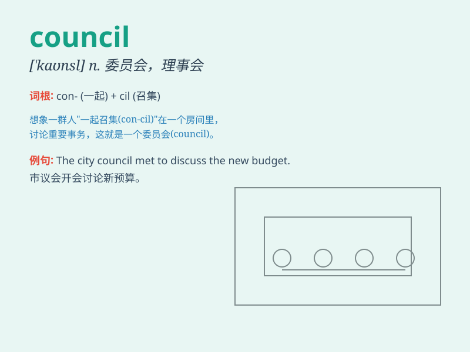

## council

**英音:** _[\'kaʊns(ə)l; -sɪl]_ **美音:** _[\'kaʊnsl]_

**译义:**
*n.政务会,理事会,委员会,参议会,讨论会议,顾问班子,立法班子*

### 短语

+ **city council:** _市议会_

+ **student council:** _学生会_

+ **advisory council:** _顾问委员会_

+ **town council:** _镇议会_

+ **council meeting:** _理事会会议_

### 例句

#### 例句1

> **The council has decided to build a new park.**

**中文翻译:** 议会决定建造一个新公园。

**单词释义:** 委员会

#### 例句2

> **She was elected to the council last year.**

**中文翻译:** 她去年当选为理事会成员。

**单词释义:** 委员会

#### 例句3

> **The student council organized a charity event.**

**中文翻译:** 学生会组织了一次慈善活动。

**单词释义:** 委员会；理事会

### 背诵小故事

> 想象一个小镇，人们为了解决各种问题而聚集在一起。这个聚集的团体就叫做
council ，他们在一间大房子里讨论，决定如何让小镇变得更好。

**想象一个小镇中人们为解决问题而聚集的团体叫
council，他们在大房子里讨论如何让小镇变好。**

### 图义

