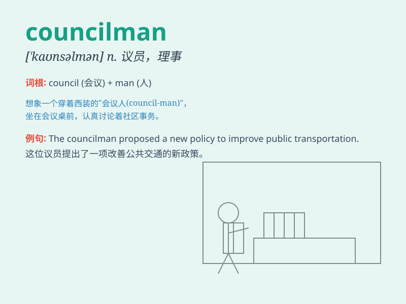

## councilman

**英音:** _[\'kaʊns(ə)lmən; -sɪl-]_ **美音:**
_[\'kaʊnslmən]_

**译义:** *n.议员,市议会议员*

### 短语

+ **city councilman:** _市议员_

+ **county councilman:** _县议员_

+ **town councilman:** _镇议员_

+ **district councilman:** _区议员_

+ **village councilman:** _村议员_

### 例句

#### 例句1

> **The councilman proposed a new policy to improve public
transportation.**

**中文翻译:** 这位议员提出了一项改善公共交通的新政策。

**单词释义:** 议员

#### 例句2

> **The councilman was re-elected for a second term.**

**中文翻译:** 该议员再次当选连任。

**单词释义:** 议员

#### 例句3

> **The councilman listened carefully to the concerns of the
constituents.**

**中文翻译:** 议员认真听取了选民的关切。

**单词释义:** 议员

### 背诵小故事

> One day, a councilman named Tom was discussing important matters in
the town hall. He had to make wise decisions to help the community.
People trusted him as he worked hard for their welfare.

**有一天，一位名叫汤姆的议员在市政厅讨论重要事务。他必须做出明智的决定来帮助社区。人们信任他，因为他为他们的福祉努力工作。**

### 图义

