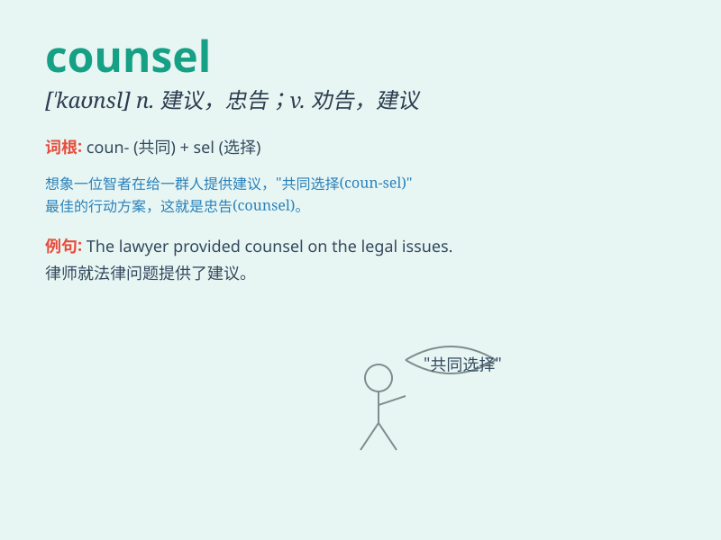

## counsel

**英音:** _[\'kaʊns(ə)l]_ **美音:** _[\'kaʊnsl]_

**译义:** *n.讨论,商议,辩护律师vt.劝告,忠告*

### 短语

+ **keep one\'s counsel:** _不发表意见，保持沉默_

+ **good counsel:** _好的建议_

+ **counsel of perfection:** _听上去完美却难以实行的劝告_

+ **take counsel:** _商量，征求意见_

+ **counsel together:** _共同商议_

### 例句

#### 例句1

> **The lawyer provided valuable counsel to his client.**

**中文翻译:** 这位律师向他的委托人提供了宝贵的建议。

**单词释义:** 建议；劝告

#### 例句2

> **She sought counsel from her parents when making a difficult
decision.**

**中文翻译:** 当她做出艰难的决定时，她向父母寻求建议。

**单词释义:** 建议；咨询

#### 例句3

> **The judge listened carefully to the counsel for the defense.**

**中文翻译:** 法官认真听取了辩方律师的陈述。

**单词释义:** 律师；法律顾问

### 背诵小故事

> A young lawyer was in a dilemma. A wise old counselor appeared and
gave him valuable counsel. The lawyer followed the advice and won the
case. \'Counsel\' means advice or guidance.

**一位年轻律师陷入困境。一位睿智的老顾问出现并给他宝贵的建议。律师听从了建议并赢得了案子。\'counsel\'意思是建议或指导。**

### 图义

