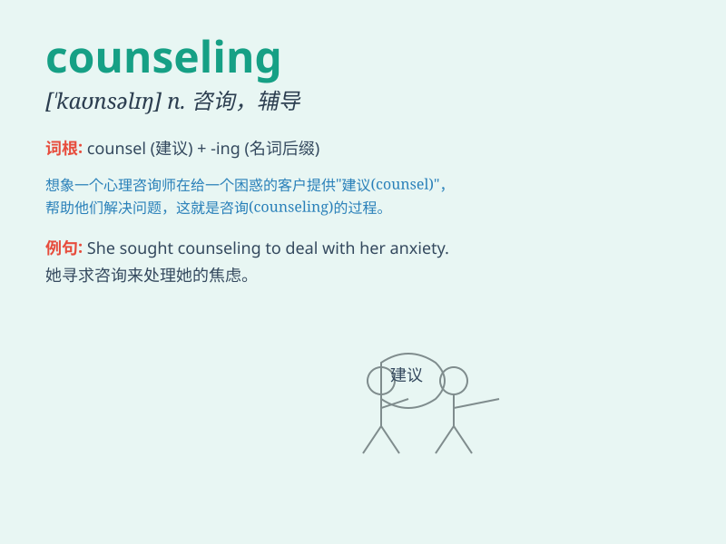

## counseling

**英音:** _[ˈkaʊnslɪŋ]_ **美音:** _[ˈkaʊnslɪŋ]_

**译义:** *n.(对个人,社会以及心理等问题的)咨询服务*

### 短语

+ **career counseling:** _职业咨询_

+ **marriage counseling:** _婚姻辅导_

+ **psychological counseling:** _心理咨询_

+ **group counseling:** _团体辅导_

+ **counseling service:** _咨询服务_

### 例句

#### 例句1

> **She sought counseling to deal with her anxiety.**

**中文翻译:** 她寻求咨询来应对她的焦虑。

**单词释义:** 咨询；辅导

#### 例句2

> **The school provides counseling services for students.**

**中文翻译:** 学校为学生提供咨询服务。

**单词释义:** 咨询服务

#### 例句3

> **Marriage counseling can help couples resolve their problems.**

**中文翻译:** 婚姻咨询可以帮助夫妻解决问题。

**单词释义:** 辅导

### 背诵小故事

> A young man was lost and confused. But with the wise counseling of an
elder, he found his way. The elder\'s advice and guidance helped him
make important decisions. Counseling can be a light in the darkness.

**一个年轻人迷茫又困惑。但在一位长者明智的辅导下，他找到了方向。长者的建议和引导帮助他做出了重要决定。辅导可以是黑暗中的一束光。**

### 图义

