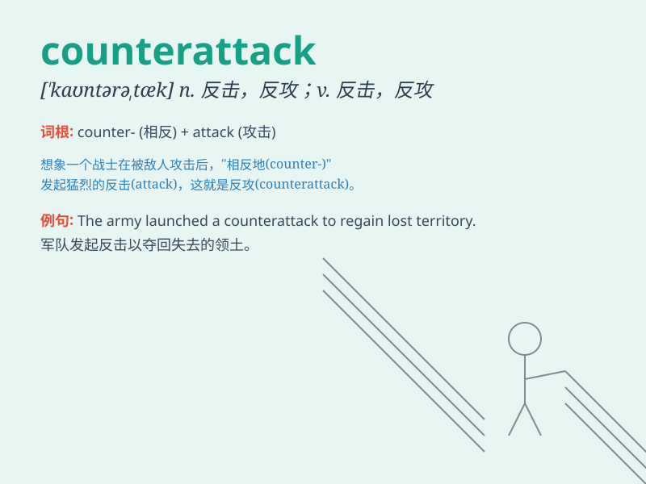

## counterattack

**英音:** _[\'kaʊntərə,tæk]_ **美音:**
_[\'kaʊntərə,tæk]_

**译义:** *n.反击,反攻v.反攻,反击*

### 短语

+ **launch a counterattack:** _发动反击_

+ **mount a counterattack:** _进行反击_

+ **stage a counterattack:** _组织反击_

+ **defend against a counterattack:** _抵御反击_

+ **prepare for a counterattack:** _为反击做准备_

### 例句

#### 例句1

> **The army launched a counterattack against the enemy.**

**中文翻译:** 军队向敌人发起反攻。

**单词释义:** 反击

#### 例句2

> **Our team prepared a counterattack to win the game.**

**中文翻译:** 我们队准备反击以赢得比赛。

**单词释义:** 反击

#### 例句3

> **The boxer delivered a powerful counterattack and knocked out his
opponent.**

**中文翻译:** 拳击手发起了强有力的反击，击倒了对手。

**单词释义:** 反击

### 背诵小故事

> In a war, the enemy kept attacking our troops. But our brave soldiers
were ready. When the enemy least expected it, we launched a
counterattack. We fought back strongly and won the battle.

**在一场战争中，敌人不断攻击我们的部队。但我们勇敢的士兵做好了准备。在敌人最意想不到的时候，我们发起了反击。我们强力回击并赢得了战斗。**

### 图义

