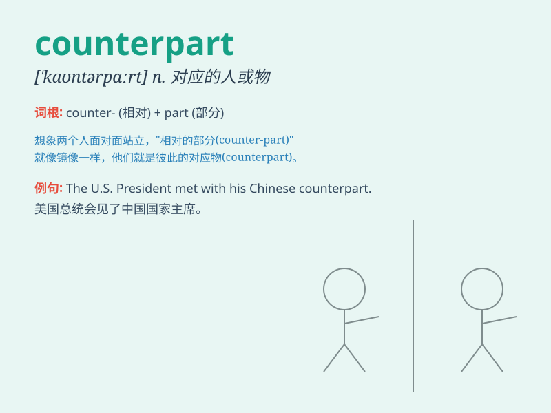

## counterpart

**英音:** _[\'kaʊntəpɑːt]_ **美音:** _[\'kaʊntɚpɑrt]_

**译义:** *n.副本,极相似的人或物,配对物*

### 短语

+ **counterpart funds:** _配套资金_

+ **counterpart talks:** _对口会谈_

+ **counterpart staff:** _对应工作人员_

+ **counterpart agency:** _对口机构_

+ **counterpart department:** _对应部门_

### 例句

#### 例句1

> **The minister held talks with his French counterpart.**

**中文翻译:** 部长与法国外长举行了会谈。

**单词释义:** 职位或作用相当的人；对应的事物

#### 例句2

> **The sales director in the New York office is the counterpart of
the sales director here.**

**中文翻译:** 纽约办事处的销售总监与这里的销售总监是对应的。

**单词释义:** 对应的人或物

#### 例句3

> **The female version of the story is very different from its male
counterpart.**

**中文翻译:** 这个故事的女性版本与男性版本有很大不同。

**单词释义:** 相对应的一方

### 背诵小故事

> 想象一个魔法世界，有两个王国。A 王国的国王是勇敢的亚瑟，B
王国的国王是智慧的威廉。威廉就是亚瑟的
counterpart，他们地位相同，但性格迥异。在面对共同的危机时，他们发挥各自的优势，携手应对。

**想象在一个魔法世界中，有两个王国，A 王国的国王亚瑟和 B
王国的国王威廉，威廉就是亚瑟的对应人物，他们地位相同但性格不同，在面对共同危机时携手合作。**

### 图义

