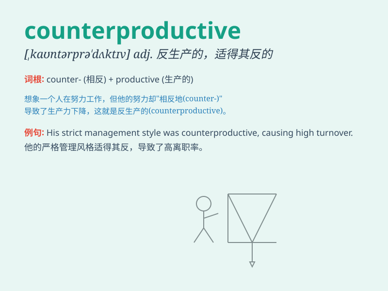

## counterproductive

**英音:** _[,kaʊntəprə\'dʌktɪv]_ **美音:**
_[,kaʊntɚprə\'dʌktɪv]_

**译义:** *adj.反生产的,使达不到预期目标的*

### 短语

+ **be counterproductive:** _是适得其反的_

+ **become counterproductive:** _变得适得其反_

+ **seem counterproductive:** _似乎适得其反_

+ **prove counterproductive:** _证明是适得其反的_

+ **remain counterproductive:** _仍然适得其反_

### 例句

#### 例句1

> **Constant criticism is counterproductive as it lowers morale.**

**中文翻译:** 持续的批评会适得其反，因为它会降低士气。

**单词释义:** 产生相反效果的；适得其反的；事与愿违的

#### 例句2

> **Trying to force him to study might be counterproductive and make
him hate learning.**

**中文翻译:** 试图强迫他学习可能会适得其反，让他讨厌学习。

**单词释义:** 产生相反效果的；适得其反的；事与愿违的

#### 例句3

> **This approach has proved counterproductive in dealing with the
problem.**

**中文翻译:** 事实证明，这种方法在解决问题时适得其反。

**单词释义:** 产生相反效果的；适得其反的；事与愿违的

### 背诵小故事

> A factory decided to cut costs by reducing quality checks. But this
led to more product defects and customer complaints. It was
counterproductive as they ended up losing money.

**一家工厂决定通过减少质量检查来降低成本。但这导致了更多的产品缺陷和客户投诉。这适得其反，因为他们最终赔了钱。**

### 图义

