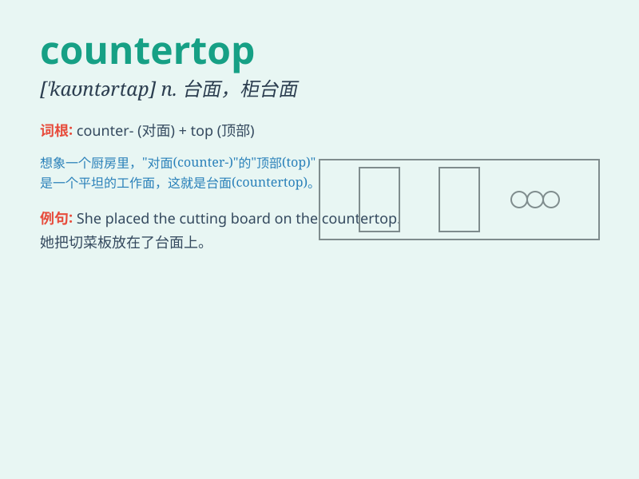

## countertop

**英音:** _[ˈkaʊntətɒp]_ **美音:** _[ˈkaʊntərtɑːp]_

**译义:** *n.(厨房的)工作台面*

### 短语

+ **granite countertop:** _花岗岩台面_

+ **kitchen countertop:** _厨房台面_

+ **marble countertop:** _大理石台面_

+ **custom countertop:** _定制台面_

+ **stainless steel countertop:** _不锈钢台面_

### 例句

#### 例句1

> **The countertop in the kitchen is made of granite.**

**中文翻译:** 厨房的台面是花岗岩制成的。

**单词释义:** 台面；工作台面

#### 例句2

> **She wiped the countertop clean after cooking.**

**中文翻译:** 做饭后，她把台面擦干净了。

**单词释义:** 台面；工作台面

#### 例句3

> **The new countertop gives the bathroom a modern look.**

**中文翻译:** 新的台面给浴室带来了现代的外观。

**单词释义:** 台面；工作台面

### 背诵小故事

> One day, I was in the kitchen and accidentally spilled juice on the
countertop. I quickly wiped it clean. The countertop is the flat surface
on which we do our food preparations.

**有一天，我在厨房不小心把果汁洒在了厨房台面上。我迅速把它擦干净。countertop
就是我们准备食物的那个平坦的表面。**

### 图义

