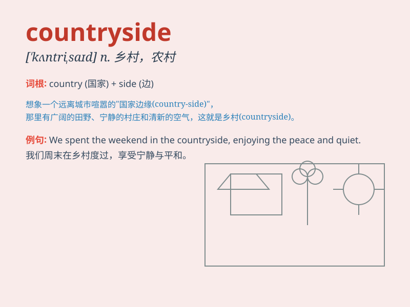

## countryside

**英音:** _[\'kʌntrɪsaɪd]_ **美音:** _[\'kʌntrɪsaɪd]_

**译义:** *n.乡下地方,乡下居民*

### 短语

+ **in the countryside:** _在乡村；在农村_

+ **rural countryside:** _乡村地区；农村地带_

+ **picturesque countryside:** _风景如画的乡村_

+ **vast countryside:** _广阔的乡村_

+ **peaceful countryside:** _宁静的乡村_

### 例句

#### 例句1

> **I love the peaceful countryside.**

**中文翻译:** 我喜欢宁静的乡村。

**单词释义:** 乡村

#### 例句2

> **They moved to the countryside to enjoy a slower pace of life.**

**中文翻译:** 他们搬到乡村享受慢节奏的生活。

**单词释义:** 乡村

#### 例句3

> **The countryside around here is very beautiful in spring.**

**中文翻译:** 这里的乡村在春天非常美丽。

**单词释义:** 乡村

### 背诵小故事

> One day, Tom left the busy city and went to the countryside. There,
he saw green fields, clear rivers, and friendly farmers. He enjoyed the
peaceful and beautiful scenery. The countryside made him feel relaxed
and happy.

**有一天，汤姆离开了繁忙的城市，去了乡下。在那里，他看到了绿色的田野、清澈的河流和友好的农民。他享受着宁静而美丽的风景。乡村让他感到放松和快乐。**

### 图义

