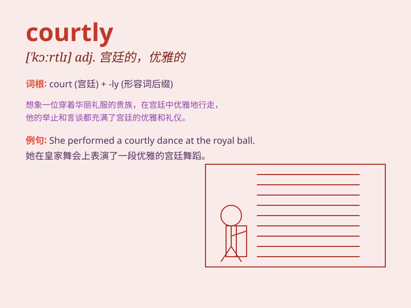

## courtly

**英音:** _[\'kɔːtlɪ]_ **美音:** _[\'kɔrtli]_

**译义:** *adj.尊严而有礼貌的*

### 短语

+ **courtly love:** _典雅爱情_

+ **courtly manner:** _优雅的举止_

+ **courtly dance:** _宫廷舞蹈_

+ **courtly etiquette:** _宫廷礼仪_

+ **courtly language:** _典雅的语言_

### 例句

#### 例句1

> **The prince moved with courtly grace.**

**中文翻译:** 王子的举动充满了宫廷的优雅。

**单词释义:** 有宫廷气派的；典雅的

#### 例句2

> **She gave a courtly smile to the guests.**

**中文翻译:** 她对客人露出礼貌的微笑。

**单词释义:** 彬彬有礼的；庄重的

#### 例句3

> **His courtly manners made him popular at the royal gatherings.**

**中文翻译:** 他的彬彬有礼的举止使他在皇室聚会上很受欢迎。

**单词释义:** （举止、仪态）有宫廷礼仪的

### 背诵小故事

> A young knight entered the court. He was courtly in his manners,
bowing gracefully and speaking politely to everyone. His courtly
behavior made him popular among the nobles.

**一位年轻的骑士进入宫廷。他举止优雅，向每个人优雅地鞠躬并且礼貌地说话。他优雅的举止使他在贵族中很受欢迎。**

### 图义

