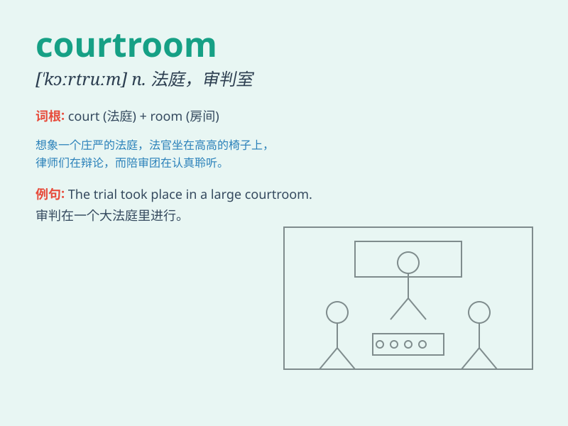

## courtroom

**英音:** _[\'kɔːtruːm; -rʊm]_ **美音:** _[\'kɔrt\'rʊm;
\'kɔrt\'rʊm]_

**译义:** *n.法庭,审判室*

### 短语

+ **enter the courtroom:** _进入法庭_

+ **leave the courtroom:** _离开法庭_

+ **courtroom drama:** _法庭剧_

+ **courtroom proceedings:** _法庭诉讼程序_

+ **courtroom atmosphere:** _法庭气氛_

### 例句

#### 例句1

> **The defendant entered the courtroom looking nervous.**

**中文翻译:** 被告进入法庭时神色紧张。

**单词释义:** 法庭

#### 例句2

> **The judge presided over the courtroom with authority.**

**中文翻译:** 法官以权威的方式主持法庭。

**单词释义:** 法庭

#### 例句3

> **The courtroom was filled with spectators waiting for the
verdict.**

**中文翻译:** 法庭上挤满了等待宣判的观众。

**单词释义:** 法庭

### 背诵小故事

> In the courtroom, a brave lawyer was defending an innocent person.
The judge listened carefully as the evidence was presented. Everyone was
tense, waiting for the final verdict. It was a crucial moment in this
legal battle.

**在法庭里，一位勇敢的律师正在为一个无辜的人辩护。法官认真倾听着证据的呈现。每个人都很紧张，等待着最终的裁决。这是这场法律之战的关键时刻。**

### 图义

