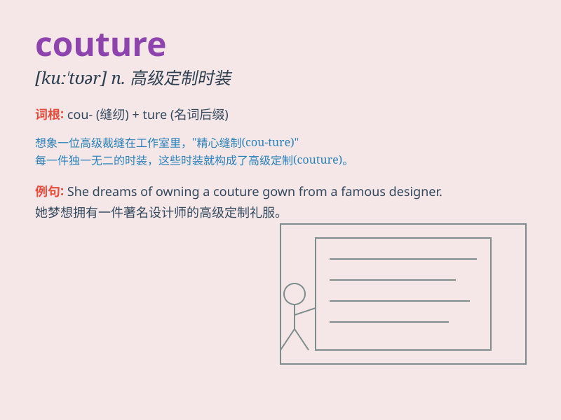

## couture

**英音:** _[kuː\'tjʊə]_ **美音:** _[ku\'tʊr]_

**译义:** *n.服装设计(师)或其服装店*

### 短语

+ **haute couture:** _高级时装_

+ **couture collection:** _时装系列_

+ **couture house:** _时装屋_

+ **couture designer:** _时装设计师_

+ **couture fashion:** _时装时尚_

### 例句

#### 例句1

> **The designer\'s couture collection was showcased at the fashion
show.**

**中文翻译:** 设计师的时装系列在时装秀上展出。

**单词释义:** 高级定制时装

#### 例句2

> **She always wears couture gowns to the red carpet events.**

**中文翻译:** 她总是穿着高级定制礼服参加红地毯活动。

**单词释义:** 高级定制服装

#### 例句3

> **The couture industry is highly competitive and exclusive.**

**中文翻译:** 高级定制时装行业竞争激烈且排他性强。

**单词释义:** 高级定制时装业

### 背诵小故事

> A young designer dreams of making it big in couture. She works hard,
creating unique and exquisite gowns. Finally, her couture collection is
showcased on a famous runway, making her a star in the fashion world.

**一位年轻的设计师梦想在高级时装界大放异彩。她努力工作，创作独特而精美的礼服。最终，她的高级时装系列在著名的T台上展示，使她成为时尚界的明星。**

### 图义

