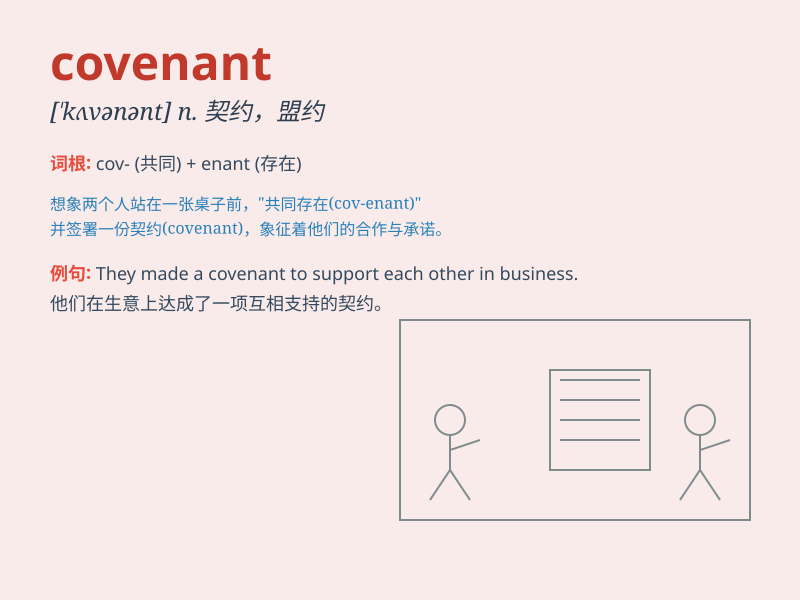

## covenant

**英音:** _[\'kʌv(ə)nənt]_ **美音:** _[\'kʌvənənt]_

**译义:** *n.契约,盟约v.缔结(盟约),立约*

### 短语

+ **covenant of warranty:** _担保契约_

+ **covenant not to compete:** _竞业禁止契约_

+ **covenant of quiet enjoyment:** _安宁享用契约_

+ **covenant of seisin:** _占有权契约_

+ **covenant of further assurance:** _进一步保证契约_

### 例句

#### 例句1

> **The company entered into a covenant not to disclose sensitive
information.**

**中文翻译:** 该公司签订了不披露敏感信息的承诺。

**单词释义:** 契约；盟约

#### 例句2

> **They broke the covenant they had made with us.**

**中文翻译:** 他们违背了与我们订立的盟约。

**单词释义:** 盟约；契约

#### 例句3

> **The covenant between the two countries was signed last year.**

**中文翻译:** 两国之间的盟约于去年签署。

**单词释义:** 契约；协议

### 背诵小故事

> In a magical forest, two tribes made a covenant to protect the sacred
tree together. They promised to stand united and keep it safe.
\'Covenant\' means a formal agreement or promise, like the one made by
the tribes.

**在一个神奇的森林里，两个部落达成了一项契约，共同保护神圣的树。他们承诺团结一致并确保其安全。\'covenant\'意思是正式的协议或承诺，就像部落之间所做的那样。**

### 图义

