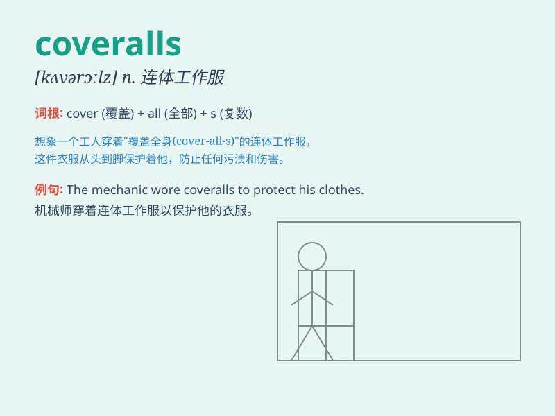

## coveralls

**英音:** _[ˈkʌvərɔːlz]_ **美音:** _[ˈkʌvərɔːlz]_

**译义:** *n. 工作服；工装裤*

### 短语

+ **protective coveralls:** _防护工作服_

+ **disposable coveralls:** _一次性防护服_

+ **chemical-resistant coveralls:** _耐化学品工作服_

+ **flame-retardant coveralls:** _阻燃工作服_

+ **sterile coveralls:** _无菌工作服_

### 例句

#### 例句1

> **The workers wore coveralls to protect their clothes from
dirt.**

**中文翻译:** 工人们穿着工作服以保护他们的衣服不被弄脏。

**单词释义:** 工作服

#### 例句2

> **She bought a pair of blue coveralls for the gardening work.**

**中文翻译:** 她买了一套蓝色的工作服用于园艺工作。

**单词释义:** 工作服

#### 例句3

> **The mechanic changed the oil in his coveralls.**

**中文翻译:** 机修工穿着工作服换了机油。

**单词释义:** 工作服

### 背诵小故事

> One day, a worker needed to do a messy job. So he wore special
clothes called coveralls to protect himself completely from dirt and
damage. These coveralls covered him from head to toe.

**有一天，一个工人需要做一项很脏的工作。所以他穿上了被称为工作服的特殊衣服来完全保护自己免受污垢和损害。这些工作服从头到脚把他包裹起来。**

### 图义

