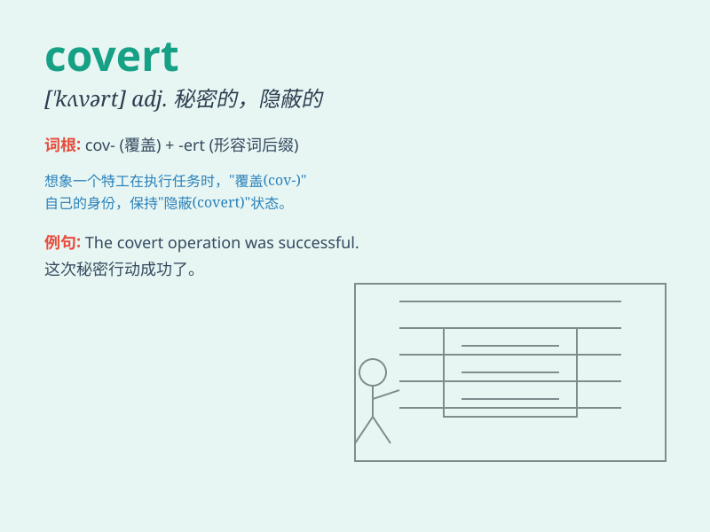

## covert

**英音:** _[\'kʌvət; \'kəʊvɜːt]_ **美音:** _[\'kovɝt]_

**译义:**
*adj.隐蔽的,偷偷摸摸的,[律]在丈夫保护下的n.掩蔽处,隐藏处*

### 短语

+ **covert operation:** _秘密行动_

+ **covert intelligence:** _秘密情报_

+ **covert attack:** _暗中攻击_

+ **covert surveillance:** _秘密监视_

+ **covert communication:** _秘密通信_

### 例句

#### 例句1

> **The spy conducted covert operations in enemy territory.**

**中文翻译:** 该间谍在敌方领土上进行秘密行动。

**单词释义:** 秘密的；隐蔽的

#### 例句2

> **They had a covert meeting in the park at night.**

**中文翻译:** 晚上他们在公园里秘密会面。

**单词释义:** 秘密的；暗中的

#### 例句3

> **The animal\'s covert was well-hidden among the bushes.**

**中文翻译:** 动物的隐蔽处隐藏在灌木丛中。

**单词释义:** 隐藏处；遮蔽处

### 背诵小故事

> A spy was sent on a covert mission. He had to sneak into the enemy\'s
base without being noticed. \'Covert\' means hidden or secret, just like
the spy\'s mission.

**一名间谍被派去执行一项秘密任务。他必须在不被注意的情况下潜入敌人的基地。'covert'意思是隐藏的、秘密的，就像间谍的任务一样。**

### 图义

