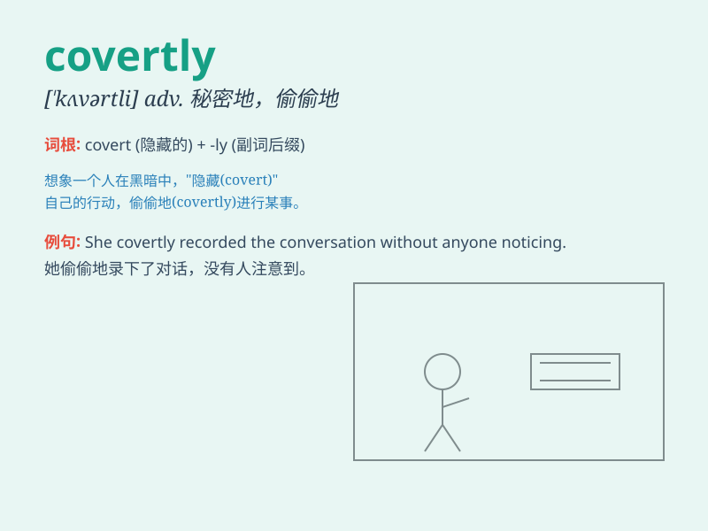

## covertly

**英音:** _[\'kʌvətlɪ]_ **美音:** _[\'kʌvətlɪ]_

**译义:** *adv.偷偷摸摸地*

### 短语

+ **act covertly:** _秘密行动_

+ **operate covertly:** _暗中操作_

+ **move covertly:** _秘密移动_

+ **watch covertly:** _暗中观察_

+ **investigate covertly:** _秘密调查_

### 例句

#### 例句1

> **He was covertly observing her from behind the bushes.**

**中文翻译:** 他在灌木丛后面偷偷地观察着她。

**单词释义:** 偷偷地

#### 例句2

> **The company was covertly collecting data on its users.**

**中文翻译:** 该公司正在秘密收集其用户的数据。

**单词释义:** 暗中

#### 例句3

> **She covertly slipped the note into his pocket.**

**中文翻译:** 她偷偷地将纸条塞进他的口袋里。

**单词释义:** 偷偷地

### 背诵小故事

> A spy was sent to gather information covertly. He wore a disguise and
moved in the shadows, avoiding being noticed. His mission was to obtain
the secret plans without anyone knowing. Covertly means secretly or in a
hidden way.

**一名间谍被派去秘密收集情报。他乔装打扮，在阴影中移动，避免被发现。他的任务是在无人知晓的情况下获取秘密计划。covertly
意思是秘密地，隐蔽地。**

### 图义

