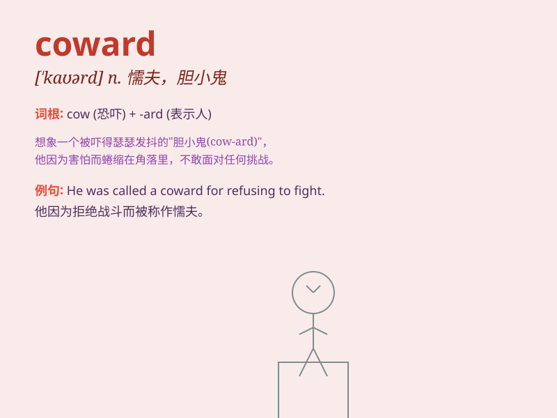

## coward

**英音:** _[\'kaʊəd]_ **美音:** _[\'kaʊɚd]_

**译义:** *n.懦弱的人,胆小的人*

### 短语

+ **coward heart:** _怯懦的心_

+ **coward act:** _懦弱的行为_

+ **coward nature:** _胆小的天性_

+ **coward soul:** _懦弱的灵魂_

+ **utter coward:** _十足的胆小鬼_

### 例句

#### 例句1

> **He was a coward and wouldn\'t stand up for himself.**

**中文翻译:** 他是个胆小鬼，不会为自己挺身而出。

**单词释义:** 胆小鬼；懦夫

#### 例句2

> **Don\'t be such a coward! Face your fears.**

**中文翻译:** 别这么胆小鬼！面对你的恐惧。

**单词释义:** 胆小的人

#### 例句3

> **The coward ran away from the fight.**

**中文翻译:** 胆小鬼逃离了战斗。

**单词释义:** 怯懦的人

### 背诵小故事

> A king was going to war. One soldier always hid when danger came. The
king called him a \'coward\' because he lacked courage. This soldier\'s
behavior made everyone disappointed.

**一位国王要去打仗。有个士兵一遇到危险就总是躲藏。国王称他为"懦夫"，因为他缺乏勇气。这个士兵的行为让所有人都很失望。**

### 图义

